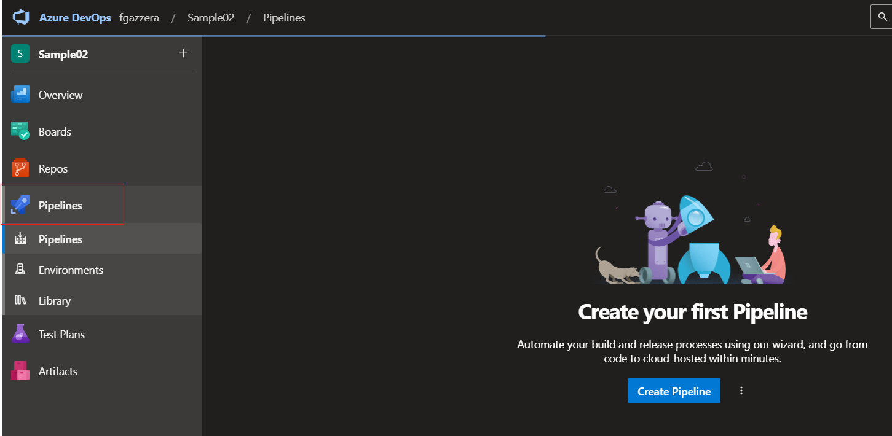
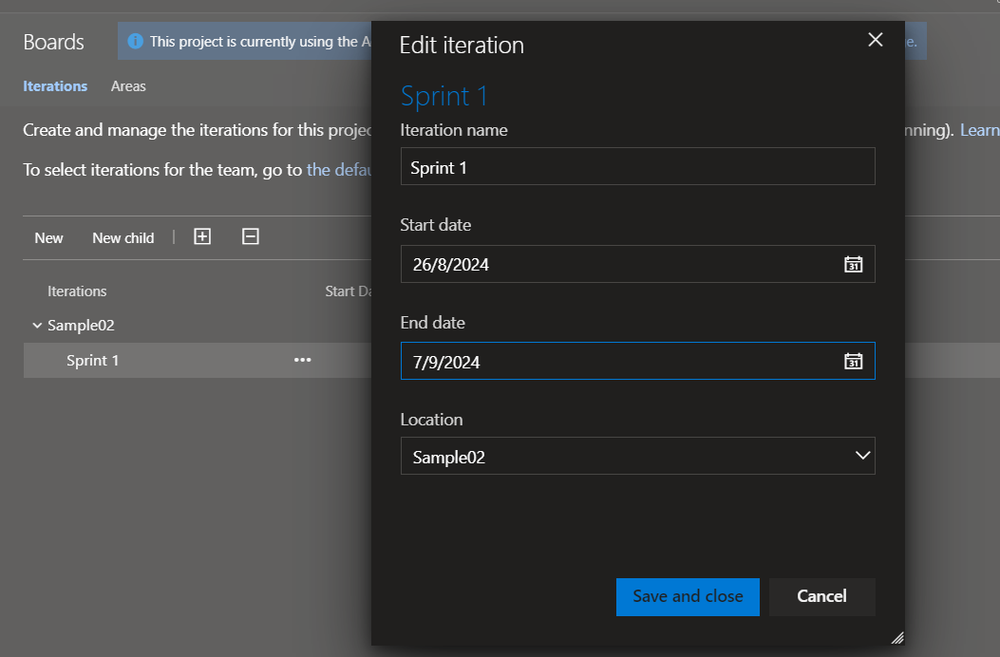

## Trabajo Práctico 3 - Introducción a Azure Devops

### 1 - Consignas a desarrollar en el trabajo práctico:

 **¿Qué es Azure DevOps?**
- Breve descripción de Azure DevOps como un conjunto de herramientas para la colaboración en desarrollo de software.
    - Azure DevOps es un conjunto de herramientas desarrollado por Microsoft que facilita la colaboración en el desarrollo de software. Ofrece servicios como control de versiones, integración continua, entrega continua (CI/CD), gestión de proyectos, pruebas automatizadas, y monitoreo, todo en un entorno integrado. Esto permite a los equipos de desarrollo trabajar de manera eficiente y coordinada, desde la planificación inicial hasta la implementación y mantenimiento de las aplicaciones.

- Beneficios de utilizar Azure DevOps en comparación con otras soluciones.
 - Beneficios de Azure DevOps:

        1. Integración Completa: Azure DevOps se integra perfectamente con otras herramientas de Microsoft y con una amplia variedad de aplicaciones de terceros, lo que facilita la gestión completa del ciclo de vida del software en una sola plataforma.

        2. Flexibilidad y Escalabilidad: Funciona bien tanto para proyectos pequeños como para grandes organizaciones, permitiendo adaptar las herramientas según las necesidades del equipo.

        3. Automatización y CI/CD: Facilita la automatización de pruebas, compilación, y despliegue de software, mejorando la eficiencia y reduciendo errores.

        4. Colaboración y Transparencia: Ofrece herramientas de comunicación y seguimiento que mejoran la visibilidad del proyecto y la colaboración entre todos los miembros del equipo.

        5. Seguridad y Control: Proporciona opciones avanzadas de seguridad y control de acceso, lo que es crucial para proyectos grandes y sensibles.

- **Componentes Principales de Azure DevOps**
  - **Azure Repos**
    - Sistema de control de versiones con Git o TFVC.
    - Funcionalidades clave: branching, pull requests, code reviews.
  - **Azure Pipelines**
    - CI/CD (Integración Continua y Entrega Continua).
    - Creación y gestión de pipelines para la automatización de build, test y deploy.
  - **Azure Boards**
    - Gestión de proyectos con Kanban y Scrum.
    - Seguimiento de tareas, bugs, y trabajo en curso.
  - **Azure Artifacts**
    - Gestión de paquetes (NuGet, npm, Maven).
    - Uso de feeds para compartir artefactos entre equipos.
  - **Azure Test Plans**
    - Herramientas para pruebas manuales y automatizadas.
    - Gestión de casos de prueba y reportes de calidad.
- **Integración con otras herramientas**
  - GitHub, Jenkins, Docker, Kubernetes.
- **Marketplace de extensiones**
  - Añadir funcionalidades adicionales a Azure DevOps.

### 2- Pasos del TP
- 3.1 Crear una cuenta en Azure DevOps

- 3.2 Crear un proyecto Sample01
    - En este caso seleccione privado pero luego desde overview modificamos para que este sea publico.

- 3.3 Crear un repo GIT desde cero

- 3.4 Crear un proyecto Sample02

- 3.5 Importar un repo desde GitHub: https://github.com/ingsoft3ucc/SimpleWebAPI.git

- 3.6 Realizar un cambio en un archivo, y subirlo al repo de ADO.
    - Realizamos un cambio en el archivo Readme.md del repo clonado en el proyecto "Sample02"

    - Una vez editado el Readme le damos al commit y comentamos.

- 3.7 Crear un pipeline, solicitar acceso a jobs de paralelismo

    - Aca seleccionamos "Crear Pipeline" y comenzamos la configuracion. En Connect selccionamos Azure Repos Git, luego en Select tocamos el proyecto "Sample02", en Configure seleccionamos Docker y le damos a "Validate and configure".

    - Una vez finalizada la configuracion le damos a "Save and Run"

    - Terminamos pero nos dio este error para solucionarlo hay que completar el formulario en el siguiente link: https://aka.ms/azpipelines-parallelism-request

- 3.8 Cambiar el tipo de proceso de Basic a Agile
    - Vamos al inicio y entramos a "Organization Settings".

    - En la barra vamos a la seccion "Boards" y seleccionamos process. Luego en Basic apretamos el numero 2 (en mi caso) para ver los proyectos los cuales querramos modificar.

    - Aca tocamos los 3 puntos y seleccionamos "Change process" y seleccionamos Agile

- 3.8 Crear un sprint

- 3.9 Crear User Stories

- 3.10 Crear Tasks y Bugs
- Ahora vamos hacer unos pasos similares a cuando creamos la User Stories, pero ahora seleccionamos Tasks y Bugs.

