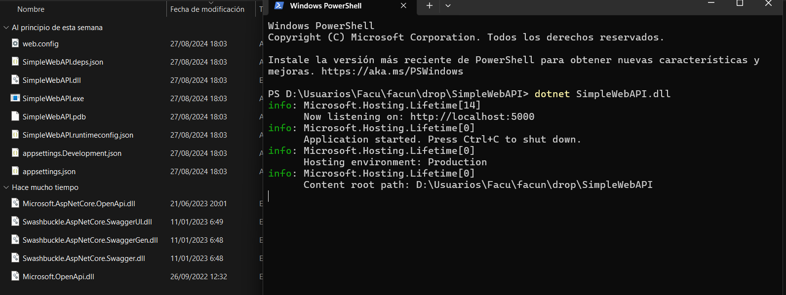
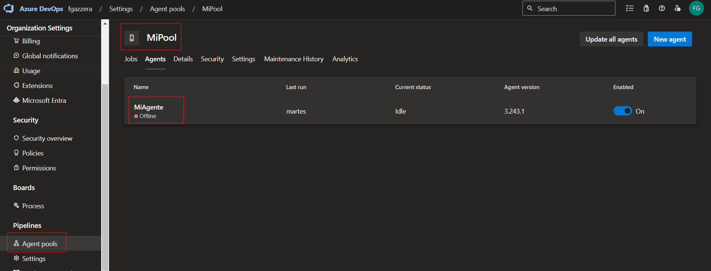
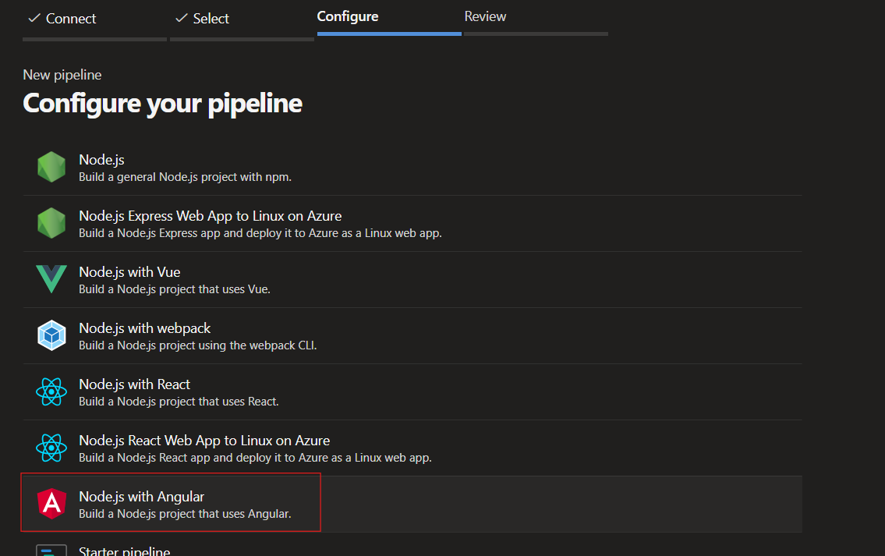
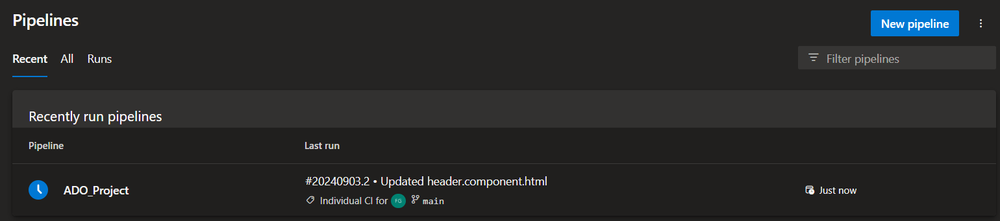

## Trabajo Práctico 4 - Azure Devops Pipelines

### 3- Consignas a desarrollar en el trabajo práctico:

 **Azure DevOps Pipelines**
  - Breve descripción de Azure DevOps Pipelines: Es una herramienta para automatizar la integración continua (CI) y la entrega continua (CD), permitiendo compilar, probar y desplegar aplicaciones de forma eficiente.
  - Tipos de Pipelines:
    - Build Pipelines: Compilan el código, ejecutan pruebas y generan artefactos para el despliegue.
    - Deploy Pipelines: Despliegan los artefactos en diferentes entornos, como desarrollo o producción.
  - Diferencias entre editor clásico y YAML:
    - Editor clásico: Usa una interfaz gráfica para configurar pipelines sin necesidad de codificación.
    - YAML: Define pipelines mediante código, ofreciendo mayor flexibilidad y control.
  - Agentes MS y Self-Hosted:
    - Agentes MS: Gestionados por Azure, simplifican la configuración y mantenimiento.
    - Agentes Self-Hosted: Gestionados por la organización, ofrecen más control, pero requieren más esfuerzo de mantenimiento.

### 4- Pasos del TP
 - 4.1 Verificar acceso a Pipelines concedido
 
 
 - 4.2 Agregar en pipeline YAML una tarea de Publish. 
    - Dentro de la seccion  le damos al boton "New Pipeline". 
 

    - A la hora de configurarlo lo conectamos desde "Azure Repos Git", luego seleccionamos nuestro repo a trabajar y en configuracion seleccionamos ""ASP.NET Core (.NET Framework)". Al ultimo en review agregamos esta parte de codigo:
 

    - Ahora al correrlo tenemos el publish:
 

 - 4.3 Explicar por qué es necesario contar con una tarea de Publish en un pipeline que corre en un agente de Microsoft en la nube.
    - La tarea de Publish es necesaria porque permite que los artefactos generados durante la ejecución del pipeline se almacenen y estén disponibles para su descarga o uso posterior en etapas de despliegue u otras operaciones.

 - 4.4 Descargar el resultado del pipeline y correr localmente el software compilado.
    - Descargamos la carpeta llamada "Drop", la descomprimo y corremos con Dotnet al .dll.
 
 

 - 4.5 Habilitar el editor clásico de pipelines. Explicar las diferencias claves entre este tipo de editor y el editor YAML.
    - Editor clásico: Usa una interfaz gráfica para configurar pipelines sin necesidad de codificación.
    - YAML: Define pipelines mediante código, ofreciendo mayor flexibilidad y control.

 - 4.6 Crear un nuevo pipeline con el editor clásico. Descargar el resultado del pipeline y correr localmente el software compilado.
 
 
 
 - 4.7 Configurar CI en ambos pipelines (YAML y Classic Editor). Mostrar resultados de la ejecución automática de ambos pipelines al hacer un commit en la rama main.
    - Classic Editor:
    

    - YAML: Debemos deshabilitarlo pero en nuestro caso lo dejamos habilitado
    

    - Hicimos un cambio en el readme y vemos como se ejecutaron los pipeline
    
    

 - 4.8 Explicar la diferencia entre un agente MS y un agente Self-Hosted. Qué ventajas y desventajas hay entre ambos? Cuándo es conveniente y/o necesario usar un Self-Hosted Agent?
 
    - Agente Microsoft (MS):
        - Descripción: Es un agente alojado en la nube por Microsoft, listo para usar y gestionado completamente por Azure DevOps.
        - Ventajas: No requiere configuración ni mantenimiento, es fácil de escalar, y está siempre disponible con un entorno preconfigurado.
        - Desventajas: Puede tener limitaciones en cuanto a software o configuraciones específicas, y podría haber costos asociados dependiendo del uso.

    - Agente Self-Hosted:
        - Descripción: Es un agente que tú configuras y mantienes en tu propia infraestructura (local o en la nube).
        - Ventajas: Mayor control sobre el entorno, lo que permite configuraciones específicas, uso de software propietario o personalizado, y potencialmente menores costos si ya tienes la infraestructura.
        - Desventajas: Requiere configuración, mantenimiento y monitoreo. Puede no ser tan escalable como un agente MS.

 - 4.8 Crear un Pool de Agentes y un Agente Self-Hosted

 - 4.9 Instalar y correr un agente en nuestra máquina local.
 
 
 
 - 4.10 Crear un pipeline que use el agente Self-Hosted alojado en nuestra máquina local.

 - 4.11 Buscar el resultado del pipeline y correr localmente el software compilado.

 - 4.12 Crear un nuevo proyecto en ADO clonado desde un repo que contenga una aplicación en Angular como por ejemplo https://github.com/ingsoft3ucc/angular-demo-project.git

   - Creamos un nuevo proyecto y clonamos en el "https://github.com/ingsoft3ucc/angular-demo-project.git"
   

 
 - 4.13 Configurar un pipeline de build para un proyecto de tipo Angular como el clonado.
      
      
      
      
      
      - Verificamos que se ejecuto correctamente
      

 - 4.14 Habilitar CI para el pipeline.

 
 - 4.15 Hacer un cambio a un archivo del proyecto (algún cambio en el HTML que se renderiza por ejemplo) y verificar que se ejecute automáticamente el pipeline.
   - En mi caso edite el Header para cambiar el titulo de la pagina
   
   
   
   - Una vez que le damos a "commit" el pipeline se ejecuto automaticamente
   
   

 - 4.16 Descargar el resultado del pipeline y correr en un servidor web local el sitio construido.
   
   

   - Una vez que descargamos la carpeta comprimida "drop", la descomprimimos y la ejecutamos: (Antes de ejecutar tenemos que tener instalado Angular)
   
   

 - 4.17 Mostrar el antes y el después del cambio.
   - Antes:
   

   - Ahora:
   