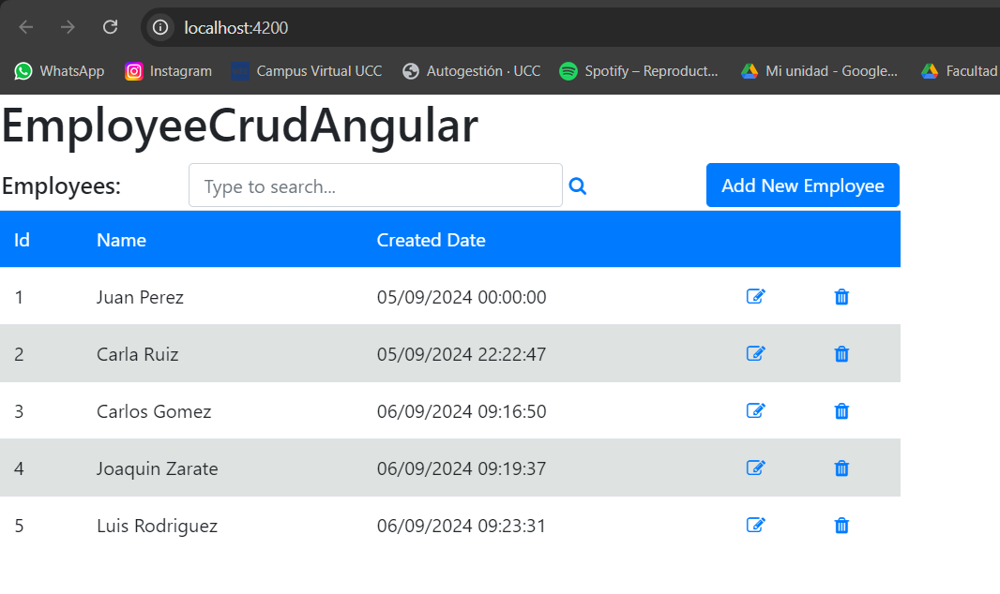
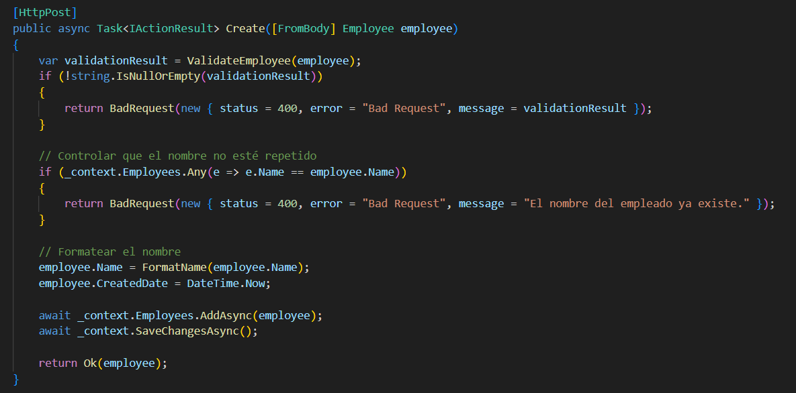

### 4- Desarrollo:
#### Prerequisitos:
- Node.js y npm:
    -   

- Angular CLI
    - 

- .NET Core 8 SDK https://dotnet.microsoft.com/en-us/download/dotnet/8.0
    - 

#### 4.1 Creación de una BD SQL Server para nuestra App
A\. Crear una BD Azure SQL Database (Ver Instructivo 5.1) o montar una imagen Docker de SQL Server como se solicitó en el punto 12 del [TP02]. (https://github.com/ingsoft3ucc/TPS_2024/blob/main/trabajos/02-introduccion-docker.md)

- Creamos una BD en Azure SQL Database


#### 4.2 Obtener nuestra App
A\. Clonar el repo https://github.com/ingsoft3ucc/Angular_WebAPINetCore8_CRUD_Sample.git

B\. Seguir las instrucciones del README.md del repo clonado prestando atención a la modificación de la cadena de conexión en el appSettings.json para que apunte a la BD creada en 4.1 

C\. Navegar a http://localhost:7150/swagger/index.html y probar uno de los controladores para verificar el correcto funcionamiento de la API.


D\. Navegar a http://localhost:4200 y verificar el correcto funcionamiento de nuestro front-end Angular


E\. Una vez verificado el correcto funcionamiento de la Aplicación procederemos a crear un proyecto de pruebas unitarias para nuestra API.

#### 4.3 Crear Pruebas Unitarias para nuestra API
A\. En el directorio raiz de nuestro repo crear un nuevo proyecto de pruebas unitarias para nuestra API 
```bash
dotnet new xunit -n EmployeeCrudApi.Tests
```


B\. Instalar dependencias necesarias

Primero, instala las siguientes bibliotecas mediante NuGet:

-**Moq**

Moq es una popular biblioteca de mocking en .NET que se utiliza en pruebas unitarias para simular el comportamiento de dependencias externas o de objetos complejos. El objetivo de Moq es ayudar a los desarrolladores a escribir pruebas unitarias aisladas sin tener que interactuar con implementaciones reales de dependencias, como bases de datos, servicios externos, APIs o archivos del sistema. De esta manera, se puede probar el código en condiciones controladas y reproducibles.
Sirve para:
  - Simular el comportamiento de dependencias: Moq permite crear versiones simuladas (mocks) de las dependencias externas (por ejemplo, interfaces o clases abstractas) para verificar cómo interactúa el código con ellas.

  - Aislamiento de pruebas: Permite aislar el código bajo prueba, garantizando que cualquier error en las dependencias externas no afecte las pruebas.

  - Verificación de interacciones: Moq puede verificar si los métodos de las dependencias se llamaron con los argumentos correctos o con qué frecuencia fueron invocados.

  - Simulación de resultados: Podemos configurar el comportamiento de los métodos simulados para que devuelvan valores específicos, excepciones o respuestas asíncronas para distintos escenarios.

  - Ejemplos de uso:
    - Configurar retornos de métodos: Se puede configurar un mock para que un método retorne un valor específico.
    - Verificar interacciones: Verificar si un método fue llamado, cuántas veces y con qué parámetros.
    - Simular excepciones: Probar cómo responde el código al manejar excepciones lanzadas por dependencias externas.
- **xUnit** 

xUnit es un marco de trabajo (framework) para pruebas unitarias en el ecosistema .NET. Es una de las opciones más populares para escribir pruebas automatizadas en proyectos de .NET, y es conocido por su simplicidad, flexibilidad y compatibilidad con varias versiones de .NET, incluyendo .NET Core y .NET 5/6/7/8.

- Características principales de xUnit:

  - Atributos de prueba:

    - **[Fact]**: Se usa para definir una prueba unitaria básica.
    - **[Theory]**: Permite ejecutar una prueba varias veces con diferentes parámetros, útil para probar múltiples casos de una misma lógica.

  - Inyección de dependencias: xUnit soporta inyección de dependencias en los constructores de las clases de prueba, lo que facilita la configuración y limpieza de las pruebas.

  - Configuración y limpieza de pruebas:
    
    - Los métodos `Dispose` permiten liberar recursos al final de cada prueba.
    - También se pueden usar los atributos **[ClassFixture]** y **[Collection]** para compartir el contexto entre pruebas y gestionar la configuración y limpieza antes o después de varias pruebas.

  - Integración con herramientas de CI/CD: xUnit se integra perfectamente con sistemas de integración continua y entrega continua (CI/CD) como **Azure DevOps**, **GitHub Actions**, y **Jenkins**, lo que lo convierte en una excelente opción para entornos de desarrollo ágiles.

  - Compatibilidad con múltiples plataformas: xUnit es compatible con **.NET Framework**, **.NET Core** y **.NET 5+**, lo que lo hace versátil y adaptable a diferentes proyectos.

  - Desventajas de NUnit y MSTest corregidas: xUnit surgió como una evolución de otros marcos como **NUnit** y **MSTest**, con el objetivo de corregir ciertas limitaciones. Por ejemplo, no utiliza métodos como `SetUp` o `TearDown` (propios de NUnit), sino que promueve el uso del constructor de clases para inicializar objetos.

- **Microsoft.EntityFrameworkCore.InMemory**

Este paquete es una implementación del proveedor InMemory para Entity Framework Core, y su propósito principal es permitir realizar pruebas unitarias y de integración en memoria, sin necesidad de conectarse a una base de datos física. Simula el comportamiento de una base de datos sin necesidad de utilizar un servidor de base de datos real. Esto es útil en las siguientes situaciones:

  * Pruebas unitarias: Con InMemory, es posible insertar datos en la base de datos simulada, realizar operaciones de consulta, actualización y eliminación, y verificar que el código funcione correctamente sin tener que preocuparnos por la conexión a una base de datos real. 
  * Prototipado rápido: Si estamos desarrollando una aplicación y necesitamos trabajar con datos sin configurar un entorno de base de datos completo, podemos usar InMemory para almacenar los datos de manera temporal mientras desarrollamos la lógica de la aplicación.
  * Aislamiento de pruebas: El proveedor InMemory garantiza que cada ejecución de prueba pueda tener su propia instancia de base de datos aislada, lo que ayuda a asegurar que las pruebas sean consistentes y no dependan de datos residuales de ejecuciones anteriores.

 

```bash
cd EmployeeCrudApi.Tests 
dotnet add package Moq
dotnet add package xunit
dotnet add package Microsoft.EntityFrameworkCore.InMemory

```

- 

C\. Editar archivo UnitTest1.cs reemplazando su contenido por
```csharp
using EmployeeCrudApi.Controllers;
using EmployeeCrudApi.Data;
using EmployeeCrudApi.Models;
using Microsoft.EntityFrameworkCore;
using System;
using System.Collections.Generic;
using System.Threading.Tasks;
using Xunit;

namespace EmployeeCrudApi.Tests
{
    public class EmployeeControllerTests
    {
        private ApplicationDbContext GetInMemoryDbContext()
        {
            var options = new DbContextOptionsBuilder<ApplicationDbContext>()
                .UseInMemoryDatabase(databaseName: Guid.NewGuid().ToString()) // Crear una nueva base de datos en memoria para cada prueba
                .Options;

            return new ApplicationDbContext(options);
        }

        [Fact]
        public async Task GetAll_ReturnsListOfEmployees()
        {
            // Arrange
            var context = GetInMemoryDbContext();
            context.Employees.AddRange(
                new Employee { Id = 1, Name = "John Doe" },
                new Employee { Id = 2, Name = "Jane Doe" }
            );
            context.SaveChanges();

            var controller = new EmployeeController(context);

            // Act
            var result = await controller.GetAll();

            // Assert
            Assert.Equal(2, result.Count);
            Assert.Equal("John Doe", result[0].Name);
            Assert.Equal("Jane Doe", result[1].Name);
        }

        [Fact]
        public async Task GetById_ReturnsEmployeeById()
        {
            // Arrange
            var context = GetInMemoryDbContext();
            context.Employees.Add(new Employee { Id = 1, Name = "John Doe" });
            context.SaveChanges();

            var controller = new EmployeeController(context);

            // Act
            var result = await controller.GetById(1);

            // Assert
            Assert.NotNull(result);
            Assert.Equal(1, result.Id);
            Assert.Equal("John Doe", result.Name);
        }

        [Fact]
        public async Task Create_AddsEmployee()
        {
            // Arrange
            var context = GetInMemoryDbContext();
            var controller = new EmployeeController(context);

            var newEmployee = new Employee { Id = 3, Name = "New Employee" };

            // Act
            await controller.Create(newEmployee);

            // Assert
            var employee = await context.Employees.FindAsync(3);
            Assert.NotNull(employee);
            Assert.Equal("New Employee", employee.Name);
        }

        [Fact]
        public async Task Update_UpdatesEmployee()
        {
            // Arrange
            var context = GetInMemoryDbContext();
            var existingEmployee = new Employee { Id = 1, Name = "Old Name" };
            context.Employees.Add(existingEmployee);
            context.SaveChanges();

            var controller = new EmployeeController(context);

            var updatedEmployee = new Employee { Id = 1, Name = "Updated Name" };

            // Act
            await controller.Update(updatedEmployee);

            // Assert
            var employee = await context.Employees.FindAsync(1);
            Assert.NotNull(employee);
            Assert.Equal("Updated Name", employee.Name);
        }

        [Fact]
        public async Task Delete_RemovesEmployee()
        {
            // Arrange
            var context = GetInMemoryDbContext();
            var employeeToDelete = new Employee { Id = 1, Name = "John Doe" };
            context.Employees.Add(employeeToDelete);
            context.SaveChanges();

            var controller = new EmployeeController(context);

            // Act
            await controller.Delete(1);

            // Assert
            var employee = await context.Employees.FindAsync(1);
            Assert.Null(employee); // Verifica que el empleado fue eliminado
        }
    }
}

```
- 

Explicación:

Este código es una serie de pruebas unitarias para un controlador EmployeeController en C# usando el framework de pruebas XUnit. Las pruebas utilizan una base de datos en memoria (in-memory) proporcionada por Entity Framework Core para evitar dependencias con una base de datos real. A continuación, te explico cómo funciona el código y dónde se realiza el mockeo.

Análisis del código
1. Método GetInMemoryDbContext:
Este método crea un contexto de base de datos en memoria utilizando Entity Framework Core. Cada prueba obtiene su propia instancia de base de datos in-memory única (por el uso de Guid.NewGuid()).

```csharp
private ApplicationDbContext GetInMemoryDbContext()
{
    var options = new DbContextOptionsBuilder<ApplicationDbContext>()
        .UseInMemoryDatabase(databaseName: Guid.NewGuid().ToString()) // Crear una base de datos en memoria para cada prueba
        .Options;

    return new ApplicationDbContext(options);
}
```
- InMemoryDatabase: Crea una base de datos temporal en memoria que se usa solo durante la ejecución de las pruebas. Esto es útil para evitar la dependencia de una base de datos física.
- Guid.NewGuid(): Cada prueba tiene su propio contexto de base de datos único, lo que asegura que las pruebas no interfieran entre sí.

2. Prueba GetAll_ReturnsListOfEmployees:
Esta prueba verifica que el controlador puede recuperar correctamente una lista de empleados.
```csharp
[Fact]
public async Task GetAll_ReturnsListOfEmployees()
{
    // Arrange
    var context = GetInMemoryDbContext();
    context.Employees.AddRange(
        new Employee { Id = 1, Name = "John Doe" },
        new Employee { Id = 2, Name = "Jane Doe" }
    );
    context.SaveChanges();

    var controller = new EmployeeController(context);

    // Act
    var result = await controller.GetAll();

    // Assert
    Assert.Equal(2, result.Count);
    Assert.Equal("John Doe", result[0].Name);
    Assert.Equal("Jane Doe", result[1].Name);
}
```
- Arrange: Inicializa el contexto en memoria, agrega algunos empleados de prueba y luego crea una instancia del controlador.
- Act: Llama al método GetAll() del controlador para recuperar los empleados.
- Assert: Verifica que se recuperaron los empleados correctamente y que sus nombres coinciden con los esperados.

3. Prueba GetById_ReturnsEmployeeById:
Verifica que se pueda recuperar un empleado por su ID.

```csharp
[Fact]
public async Task GetById_ReturnsEmployeeById()
{
    // Arrange
    var context = GetInMemoryDbContext();
    context.Employees.Add(new Employee { Id = 1, Name = "John Doe" });
    context.SaveChanges();

    var controller = new EmployeeController(context);

    // Act
    var result = await controller.GetById(1);

    // Assert
    Assert.NotNull(result);
    Assert.Equal(1, result.Id);
    Assert.Equal("John Doe", result.Name);
}
```
- Similar a la prueba anterior, pero en este caso se verifica que el método GetById() funcione correctamente.

4. Prueba Create_AddsEmployee:
Verifica que se puede crear un nuevo empleado y que se almacene correctamente en la base de datos.
```csharp
[Fact]
public async Task Create_AddsEmployee()
{
    // Arrange
    var context = GetInMemoryDbContext();
    var controller = new EmployeeController(context);
    var newEmployee = new Employee { Id = 3, Name = "New Employee" };

    // Act
    await controller.Create(newEmployee);

    // Assert
    var employee = await context.Employees.FindAsync(3);
    Assert.NotNull(employee);
    Assert.Equal("New Employee", employee.Name);
}
```
- Act: Llama al método Create del controlador para agregar un nuevo empleado.
- Assert: Verifica que el empleado fue agregado a la base de datos in-memory correctamente.

5. Prueba Update_UpdatesEmployee:
Verifica que se pueda actualizar la información de un empleado existente
```csharp
[Fact]
public async Task Update_UpdatesEmployee()
{
    // Arrange
    var context = GetInMemoryDbContext();
    var existingEmployee = new Employee { Id = 1, Name = "Old Name" };
    context.Employees.Add(existingEmployee);
    context.SaveChanges();

    var controller = new EmployeeController(context);
    var updatedEmployee = new Employee { Id = 1, Name = "Updated Name" };

    // Act
    await controller.Update(updatedEmployee);

    // Assert
    var employee = await context.Employees.FindAsync(1);
    Assert.NotNull(employee);
    Assert.Equal("Updated Name", employee.Name);
}
```
- Act: Actualiza el empleado llamando a Update.
- Assert: Verifica que el nombre del empleado fue actualizado correctamente.

6. Prueba Delete_RemovesEmployee:
Verifica que se puede eliminar un empleado.
```csharp
[Fact]
public async Task Delete_RemovesEmployee()
{
    // Arrange
    var context = GetInMemoryDbContext();
    var employeeToDelete = new Employee { Id = 1, Name = "John Doe" };
    context.Employees.Add(employeeToDelete);
    context.SaveChanges();

    var controller = new EmployeeController(context);

    // Act
    await controller.Delete(1);

    // Assert
    var employee = await context.Employees.FindAsync(1);
    Assert.Null(employee); // Verifica que el empleado fue eliminado
}
```
- Act: Llama al método Delete del controlador para eliminar un empleado.
- Assert: Verifica que el empleado fue eliminado correctamente de la base de datos in-memory.

7. ¿Dónde ocurre el mockeo?
- In-memory database (mockeo del contexto de la base de datos): En este código, el mockeo se realiza principalmente mediante el uso de la base de datos en memoria. Se utiliza el método UseInMemoryDatabase() para crear una base de datos simulada para las pruebas, lo que permite probar el controlador sin interactuar con una base de datos real.
- EmployeeController: El controlador utiliza este contexto simulado para realizar operaciones CRUD durante las pruebas.

8. Resumen:
- El mockeo principal es la base de datos en memoria, que permite realizar operaciones de consulta, creación, actualización y eliminación sin necesidad de una base de datos real.
- Cada prueba crea un nuevo contexto de base de datos en memoria para asegurar que las pruebas no interfieran entre sí.
- Se cubren operaciones básicas del controlador: obtener todos los empleados, obtener un empleado por ID, crear, actualizar y eliminar empleados.

D\. Renombrar archivo UnitTest1.cs por EmployeeControllerUnitTests.cs
```bash
mv UnitTest1.cs EmployeeControllerUnitTests.cs 
```

- 

E\. Editar el archivo EmployeeCrudApi.Tests/EmployeeCrudApi.Tests.csproj para agregar una referencia a nuestro proyecto de EmployeeCrudApi reemplazando su contenido por
```xml
<Project Sdk="Microsoft.NET.Sdk">

  <PropertyGroup>
    <TargetFramework>net8.0</TargetFramework>
    <ImplicitUsings>enable</ImplicitUsings>
    <Nullable>enable</Nullable>

    <IsPackable>false</IsPackable>
    <IsTestProject>true</IsTestProject>
  </PropertyGroup>

  <ItemGroup>
    <PackageReference Include="coverlet.collector" Version="6.0.0" />
    <PackageReference Include="Microsoft.EntityFrameworkCore.InMemory" Version="8.0.8" />
    <PackageReference Include="Microsoft.NET.Test.Sdk" Version="17.8.0" />
    <PackageReference Include="Moq" Version="4.20.71" />
    <PackageReference Include="xunit" Version="2.9.0" />
    <PackageReference Include="xunit.runner.visualstudio" Version="2.5.3" />
  </ItemGroup>

  <ItemGroup>
    <ProjectReference Include="../EmployeeCrudApi/EmployeeCrudApi/EmployeeCrudApi.csproj" />
  </ItemGroup>

  <ItemGroup>
    <Using Include="Xunit" />
  </ItemGroup>

</Project>

```
- 


F\. Ejecutar los siguientes comandos para ejecutar nuestras pruebas
```bash
dotnet build
dotnet test
```

G\. Verificar que se hayan ejecutado correctamente las pruebas


- 


H\. Verificar que no estamos usando una dependencia externa como la base de datos.

I\. Modificar la cadena de conexión en el archivo appsettings.json para que use un usuario o password incorrecto y recompilar el proyecto EmployeeCrudApi

- Modificamos la cadena de conexion cambiando la clave a "test" para que falle la conexion a la BD y demostrar asi que no hay dependencia externa en los test unitarios.


```bash
dotnet build
dotnet run --urls "http://localhost:7150"
```

- Recompile el proyecto y vemos que todo se hizo correctamente.
- 
- 

J\. Verificar que nuestro proyecto ya no tiene acceso a la BD navegando a http://localhost:7150/swagger/index.html y probando uno de los controladores:
- 

K\. En la carpeta de nuestro proyecto EmployeeCrudApi.Tests volver a correr las pruebas
```bash
dotnet build
dotnet test
```

L\. Verificar que se hayan ejecutado correctamente las pruebas inclusive sin tener acceso a la BD, lo que confirma que es efectivamente un conjunto de pruebas unitarias que no requieren de una dependencia externa para funcionar.
- 

M\. Modificar la cadena de conexión en el archivo appsettings.json para que use el usuario y password correcto y recompilar el proyecto EmployeeCrudApi
```bash
dotnet build
dotnet run --urls "http://localhost:7150"
```
- 
- 

N\. Verificar que nuestro proyecto vuelve a tener acceso a la BD navegando a http://localhost:7150/swagger/index.html y probando uno de los controladores:
- Probamos nuevamente el GET y vemos que funciona correctamente:
- 

#### 4.4 Creamos pruebas unitarias para nuestro front de Angular:
Intro\. 
Para las pruebas unitarias de nuestro front en Angular utilizaremos Jasmine y Karma, herramientas ampliamente utilizadas para pruebas unitarias en aplicaciones web, especialmente en proyectos de Angular.

- **Jasmine**: Es un framework de pruebas unitarias para JavaScript. Es popular porque no requiere dependencias externas y es fácil de usar. Jasmine se utiliza para escribir pruebas de manera estructurada y ofrece un conjunto de funciones para facilitar la verificación del comportamiento del código.
  - Características principales:
    - Sintaxis descriptiva: Jasmine permite escribir pruebas en un estilo de "BDD" (Desarrollo Orientado a Comportamiento). Usa palabras clave como describe, it, expect para definir pruebas de forma muy legible.
    - Sin dependencias externas: A diferencia de otros frameworks de prueba, Jasmine no necesita ninguna biblioteca externa para funcionar.
    - Espías (Spies): Jasmine permite observar llamadas a funciones, rastrearlas y verificar si fueron llamadas correctamente.

- **Karma**: Es un test runner (ejecutor de pruebas) que facilita la ejecución de pruebas en varios navegadores. Está diseñado para trabajar con frameworks de pruebas como Jasmine, Mocha, entre otros. Karma se integra perfectamente con proyectos de Angular y es parte del Angular CLI.
  - Características principales:
    - Soporte de múltiples navegadores: Karma permite ejecutar pruebas en diferentes navegadores (Chrome, Firefox, Safari, etc.) de forma automática.
    - Ejecución en modo de observación: Karma puede detectar cambios en los archivos y ejecutar las pruebas automáticamente en cuanto se modifican.
    - Generación de informes: Karma proporciona informes detallados sobre el resultado de las pruebas.
    - Integración con CI/CD: Se puede integrar con sistemas de integración continua como Azure Devops, Jenkins, Travis CI o CircleCI para ejecutar las pruebas automáticamente en un entorno controlado.
  - Flujo de trabajo con Karma:
    - Karma inicia un servidor.
    - Abre un navegador (o varios) y ejecuta las pruebas en cada uno de ellos.
    - Karma se queda a la espera de cambios en el código, ejecutando nuevamente las pruebas si detecta modificaciones.

A\. Nos posicionamos en nuestro proyecto de front, en el directorio EmployeeCrudAngular/src/app
```bash
pwd
```


B\. Editamos el archivo app.component.spec.ts reemplazando su contenido por:
```typescript
import { TestBed } from '@angular/core/testing';
import { AppComponent } from './app.component'; // Ajusta la ruta si es necesario

describe('AppComponent', () => {
  beforeEach(async () => {
    await TestBed.configureTestingModule({
      imports: [AppComponent], // Usa imports en lugar de declarations
    }).compileComponents();
  });

  it('should render title', () => {
    const fixture = TestBed.createComponent(AppComponent);
    fixture.detectChanges();
    const compiled = fixture.nativeElement as HTMLElement;
    expect(compiled.querySelector('h1')?.textContent).toContain('EmployeeCrudAngular');
  });

});
```
Explicación:

Este código realiza una prueba unitaria para el componente AppComponent en una aplicación de Angular utilizando Jasmine y TestBed para configurar el entorno de pruebas. A continuación se explica cómo funciona y dónde se realiza el mockeo:

Análisis del código:

1. Configuración del entorno de prueba:
El bloque beforeEach se ejecuta antes de cada prueba y configura el entorno de pruebas utilizando TestBed.
```typescript
beforeEach(async () => {
  await TestBed.configureTestingModule({
    imports: [AppComponent], // Usa imports en lugar de declarations
  }).compileComponents();
});
```
- TestBed: Es la clase principal en Angular que permite configurar y crear un entorno de pruebas para los componentes, servicios y módulos.
- compileComponents: Este método compila los componentes declarados, asegurando que todo el HTML y el CSS del componente se carguen correctamente antes de ejecutar las pruebas.

2. Prueba del título renderizado:
La prueba it verifica que el título del componente AppComponent se renderice correctamente en el DOM.
```typescript
it('should render title', () => {
  const fixture = TestBed.createComponent(AppComponent); // Crea una instancia del componente
  fixture.detectChanges(); // Dispara el ciclo de detección de cambios de Angular para renderizar el componente
  const compiled = fixture.nativeElement as HTMLElement; // Obtiene el DOM renderizado del componente
  expect(compiled.querySelector('h1')?.textContent).toContain('EmployeeCrudAngular'); // Verifica si el h1 contiene el texto 'EmployeeCrudAngular'
});
```
3. Mockeo en este código:
Este código en particular no realiza ningún mockeo explícito. Es decir, no está utilizando servicios externos ni llamadas HTTP que necesiten ser simuladas (mockeadas).

Sin embargo, en una prueba de componentes como esta, el mockeo podría ser necesario si:

- El componente depende de servicios: Si el AppComponent dependiera de un servicio para obtener datos, este servicio tendría que ser simulado (mockeado) para evitar llamadas reales a una API o a otros recursos externos.
- El componente tiene dependencias complejas: En esos casos, se podrían usar objetos o servicios falsos (mocks) para simular el comportamiento de las dependencias.

4. Resumen:
- TestBed se utiliza para configurar el entorno de prueba y crear una instancia del componente.
- No se realiza mockeo explícito, ya que esta prueba solo verifica la correcta renderización del título del componente y no interactúa con servicios o datos externos.

Si el componente fuera más complejo, necesitarías simular las dependencias, pero en este caso no es necesario debido a la simplicidad del componente.

C\. Creamos el archivo employee.service.spec.ts reemplazando su contenido por:
```typescript
import { TestBed } from '@angular/core/testing';
import { HttpClientTestingModule, HttpTestingController } from '@angular/common/http/testing';
import { EmployeeService } from './employee.service';
import { Employee } from './employee.model';
import { DatePipe } from '@angular/common';

describe('EmployeeService', () => {
  let service: EmployeeService;
  let httpMock: HttpTestingController;
  let datePipe: DatePipe;

  beforeEach(() => {
    TestBed.configureTestingModule({
      imports: [HttpClientTestingModule],
      providers: [
        EmployeeService,
        DatePipe
      ]
    });

    service = TestBed.inject(EmployeeService);
    httpMock = TestBed.inject(HttpTestingController);
    datePipe = TestBed.inject(DatePipe);
  });

  afterEach(() => {
    httpMock.verify();
  });


  it('should retrieve all employees', () => {
    const today = new Date();
    const expectedDateTime = datePipe.transform(today, 'dd/MM/yyyy HH:mm:ss', undefined) ?? '';  // Consistente con el servicio

    const dummyEmployees: Employee[] = [
      new Employee(1, 'John Doe', expectedDateTime),
      new Employee(2, 'Jane Smith', expectedDateTime)
    ];

    service.getAllEmployee().subscribe(employees => {
      expect(employees.length).toBe(2);
      employees.forEach((employee, index) => {
        // Agrega depuración aquí
        console.log('Employee createdDate:', datePipe.transform(employee.createdDate, 'dd/MM/yyyy HH:mm:ss', undefined)?? '');  // Imprimir el valor generado por el servicio
        console.log('Dummy employee createdDate:', datePipe.transform(dummyEmployees[index].createdDate, 'MM/dd/yyyy HH:mm:ss', undefined)?? '');   // Imprimir el valor esperado

        expect(datePipe.transform(employee.createdDate, 'dd/MM/yyyy HH:mm:ss', undefined)?? '').toEqual(datePipe.transform(dummyEmployees[index].createdDate, 'MM/dd/yyyy HH:mm:ss', undefined)?? '');  // Compara la fecha completa
      });
    });

    const req = httpMock.expectOne(`${service.apiUrlEmployee}/getall`);
    expect(req.request.method).toBe('GET');
    req.flush(dummyEmployees);
  });


});
```

- 

Explicación:

Este código es una prueba unitaria para un servicio de Angular llamado EmployeeService, utilizando Jasmine como framework de pruebas y HttpClientTestingModule para simular las peticiones HTTP.

Análisis del código:
1. Configuración del entorno de prueba:
El bloque beforeEach se ejecuta antes de cada prueba y configura el entorno para la ejecución.
```typescript
beforeEach(() => {
  TestBed.configureTestingModule({
    imports: [HttpClientTestingModule], // Importa un módulo de prueba para simular HttpClient
    providers: [
      EmployeeService, // Proveedor del servicio a probar
      DatePipe         // Proveedor de DatePipe (para formatear fechas)
    ]
  });

  service = TestBed.inject(EmployeeService); // Inyecta el servicio `EmployeeService` que se va a probar
  httpMock = TestBed.inject(HttpTestingController); // Inyecta `HttpTestingController` para simular las peticiones HTTP
  datePipe = TestBed.inject(DatePipe); // Inyecta `DatePipe` para formatear fechas en la prueba
});
```
**HttpClientTestingModule:** Se utiliza para evitar realizar peticiones HTTP reales. Este módulo permite simular y controlar las peticiones que realiza el servicio durante la prueba.

**HttpTestingController:** Es el objeto que permite controlar y verificar las peticiones HTTP que realiza el servicio.

2. Mockeado y verificación de peticiones HTTP:
En la prueba (it), se verifica que el servicio getAllEmployee haga la petición HTTP correctamente y que los datos recibidos coincidan con los esperados.
```typescript
it('should retrieve all employees', () => {
  const today = new Date();
  const expectedDateTime = datePipe.transform(today, 'dd/MM/yyyy HH:mm:ss', undefined) ?? ''; // Formatea la fecha actual

  const dummyEmployees: Employee[] = [
    new Employee(1, 'John Doe', expectedDateTime),
    new Employee(2, 'Jane Smith', expectedDateTime)
  ];

  // Se simula la llamada al servicio
  service.getAllEmployee().subscribe(employees => {
    expect(employees.length).toBe(2); // Verifica que se reciban dos empleados
    employees.forEach((employee, index) => {
      // Compara la fecha formateada del servicio con la de los datos mockeados
      expect(datePipe.transform(employee.createdDate, 'dd/MM/yyyy HH:mm:ss', undefined) ?? '').toEqual(
        datePipe.transform(dummyEmployees[index].createdDate, 'MM/dd/yyyy HH:mm:ss', undefined) ?? ''
      );
    });
  });

  // Se espera que se haya hecho una petición GET
  const req = httpMock.expectOne(`${service.apiUrlEmployee}/getall`);
  expect(req.request.method).toBe('GET');

  // Simula la respuesta de la API con los datos de `dummyEmployees`
  req.flush(dummyEmployees);
});
```

**Dónde se realiza el mockeo?**
1. Mockeo de peticiones HTTP:

- HttpClientTestingModule y HttpTestingController permiten simular las peticiones HTTP realizadas por el servicio.
- El código httpMock.expectOne() se asegura de que se realice una solicitud a la URL correcta.
- El método req.flush() simula la respuesta de la API devolviendo los datos mockeados (dummyEmployees).

2. Datos mockeados:

- dummyEmployees es un arreglo de empleados ficticios que simula la respuesta de la API. Se compara con los datos reales que el servicio devuelve para asegurarse de que los empleados se han recibido y formateado correctamente.

3- Uso de DatePipe:
  El DatePipe se utiliza tanto en el servicio como en la prueba para garantizar que las fechas se formateen correctamente. La prueba compara las fechas formateadas de los datos recibidos con las fechas formateadas de los datos mockeados.

4- Resumen:
El código mockea:

- La respuesta de la API (con dummyEmployees).
- Las peticiones HTTP usando HttpClientTestingModule y HttpTestingController. Esto permite que la prueba se ejecute sin realizar llamadas reales a una API.

D\. Editamos el archivo employee.component.spec.ts ubicado en la carpeta **employee** reemplazando su contenido por:

```typescript
import { TestBed } from '@angular/core/testing';
import { EmployeeComponent } from './employee.component';
import { HttpClientTestingModule } from '@angular/common/http/testing';
import { DatePipe } from '@angular/common';

describe('EmployeeComponent', () => {
  beforeEach(() => {
    TestBed.configureTestingModule({
      imports: [EmployeeComponent, HttpClientTestingModule],
      providers: [DatePipe] // Añade DatePipe a los proveedores
    });
  });

  it('should create', () => {
    const fixture = TestBed.createComponent(EmployeeComponent);
    const component = fixture.componentInstance;
    expect(component).toBeTruthy();
  });
});
```
Explicación:
Este código realiza una prueba unitaria del componente EmployeeComponent utilizando Jasmine y TestBed. A continuación, se explica cómo funciona y dónde se lleva a cabo el mockeo (si lo hay).

Análisis del código:
1. Configuración del entorno de prueba:
El bloque beforeEach configura el entorno de pruebas para el EmployeeComponent.
```typescript
beforeEach(() => {
  TestBed.configureTestingModule({
    imports: [EmployeeComponent, HttpClientTestingModule], // Importa el componente y el módulo de pruebas HTTP
    providers: [DatePipe] // Proporciona el DatePipe para ser usado en las pruebas
  });
});
```
- TestBed: Es el entorno de pruebas para Angular que permite configurar módulos, componentes y servicios para pruebas.
- imports: En esta prueba, se importa el propio EmployeeComponent y el HttpClientTestingModule, que es un módulo proporcionado por Angular para realizar pruebas de HTTP sin hacer llamadas reales a una API.
- providers: Aquí se está proporcionando el DatePipe, que se puede usar para realizar transformaciones de fechas dentro del componente. Si EmployeeComponent lo necesita, estará disponible para inyección de dependencias.

2. Prueba de creación del componente:
Esta prueba simple verifica que el EmployeeComponent se pueda crear correctamente.
```typescript
it('should create', () => {
  const fixture = TestBed.createComponent(EmployeeComponent); // Crea una instancia de `EmployeeComponent`
  const component = fixture.componentInstance; // Obtiene la instancia del componente
  expect(component).toBeTruthy(); // Verifica que la instancia del componente sea válida
});
```
- fixture: Es el contenedor para una instancia del componente en el contexto de prueba. A través del fixture se puede interactuar con el componente y el DOM asociado.
- component: La instancia real del EmployeeComponent que se crea en la prueba.
- expect: La prueba verifica que el componente se haya creado correctamente, comprobando que el componente no sea null o undefined.

3. Mockeo en este código:
El mockeo explícito ocurre a través del uso de HttpClientTestingModule.

- HttpClientTestingModule: Este módulo de pruebas reemplaza el HttpClient real con un cliente HTTP simulado, evitando que se realicen solicitudes HTTP reales durante la prueba. Así se "mockea" cualquier solicitud HTTP que podría haber sido realizada por el EmployeeComponent al backend.
- DatePipe: Aunque se proporciona el DatePipe para ser utilizado en las pruebas, no se está realizando ningún mockeo sobre este en el código. Se está utilizando la implementación real del DatePipe.

4. ¿Dónde ocurre el mockeo?
- El mockeo principal ocurre en el uso de HttpClientTestingModule. Al incluir este módulo, cualquier llamada HTTP realizada por EmployeeComponent será interceptada por un servicio HTTP simulado, evitando solicitudes reales a un backend.

En esta prueba en particular, el enfoque está en verificar que el componente se crea correctamente, por lo que no se están simulando interacciones con el backend. Si se realizaran solicitudes HTTP dentro del componente, este mockeo sería gestionado por el HttpTestingController para interceptar las llamadas.

5. Resumen:
- TestBed configura el entorno de prueba para el EmployeeComponent.
- HttpClientTestingModule mockea cualquier solicitud HTTP, asegurando que no se realicen llamadas reales a la API.
- DatePipe se inyecta como proveedor, pero no se realiza ningún mockeo sobre él.
- La prueba verifica que el componente se cree correctamente.


E\. Editamos el archivo addemployee.component.spec.ts ubicado en la carpeta **addemployee** reemplazando su contenido por:
```typescript
import { TestBed } from '@angular/core/testing';
import { AddemployeeComponent } from './addemployee.component';
import { HttpClientTestingModule } from '@angular/common/http/testing';
import { ActivatedRoute } from '@angular/router';
import { of } from 'rxjs'; // para simular observables
import { DatePipe } from '@angular/common';

describe('AddemployeeComponent', () => {
  beforeEach(() => {
    TestBed.configureTestingModule({
      imports: [AddemployeeComponent, HttpClientTestingModule],
      providers: [
        DatePipe,
        {
          provide: ActivatedRoute, // Simula ActivatedRoute
          useValue: {
            params: of({ id: 1 }) // simula el parámetro id en la URL
          }
        }
      ]
    });
  });

  it('should create', () => {
    const fixture = TestBed.createComponent(AddemployeeComponent);
    const component = fixture.componentInstance;
    expect(component).toBeTruthy();
  });
});
```
Explicación:
Este código realiza una prueba unitaria del componente AddemployeeComponent en Angular utilizando Jasmine y TestBed. A continuación, se explica cómo funciona y dónde se realiza el mockeo.

Análisis del código:
1. Configuración del entorno de prueba:
En el bloque beforeEach, se configura el entorno de pruebas para el componente AddemployeeComponent.
```typescript
beforeEach(() => {
  TestBed.configureTestingModule({
    imports: [AddemployeeComponent, HttpClientTestingModule], // Importa el componente y módulo de pruebas HTTP
    providers: [
      DatePipe, // Inyecta DatePipe para el formateo de fechas en el componente
      {
        provide: ActivatedRoute, // Simula ActivatedRoute
        useValue: {
          params: of({ id: 1 }) // Simula el parámetro de la ruta (id) como observable
        }
      }
    ]
  });
});
```
- TestBed: Configura el entorno de pruebas para que puedas probar tu componente dentro del mismo.
- imports: Aquí se importa el propio componente AddemployeeComponent y el módulo HttpClientTestingModule, que es un mock del HttpClient para pruebas.
- providers: Define inyecciones de dependencias para el componente.
- DatePipe: Se inyecta el DatePipe, útil si el componente necesita realizar operaciones de formateo de fechas.
- ActivatedRoute: Se provee un mock de ActivatedRoute usando useValue. Esto permite simular un parámetro de la URL (en este caso, { id: 1 }) sin tener que usar el enrutador real.

2. Prueba de creación del componente:
Este test verifica que el componente AddemployeeComponent se crea correctamente.
```typescript
it('should create', () => {
  const fixture = TestBed.createComponent(AddemployeeComponent); // Crea una instancia de AddemployeeComponent
  const component = fixture.componentInstance; // Obtiene la instancia del componente
  expect(component).toBeTruthy(); // Verifica que el componente ha sido creado correctamente
});
```
- fixture: Es el contenedor que proporciona acceso a una instancia del componente en el contexto de prueba.
- component: Es la instancia real del componente AddemployeeComponent.
- expect: Verifica que el componente se haya creado correctamente.

3. Mockeo en este código:

En este código, se realizan varios mockeos importantes:

- HttpClientTestingModule: Este módulo reemplaza el HttpClient real con uno simulado para evitar realizar llamadas HTTP reales en el contexto de pruebas.
- ActivatedRoute: Se provee un mock de ActivatedRoute para simular parámetros de ruta. En este caso, params: of({ id: 1 }) simula que la ruta actual tiene un parámetro id con valor 1. Esto es útil si el componente depende de los parámetros de la ruta para cargar datos o realizar operaciones específicas.

4. ¿Dónde ocurre el mockeo?
- HttpClientTestingModule: Mockea las llamadas HTTP realizadas por el AddemployeeComponent. Si el componente hace solicitudes HTTP, estas serán interceptadas por el mock.
- ActivatedRoute: Se mockea usando useValue para simular los parámetros de la URL. En este caso, se está simulando que el parámetro id en la URL es 1, sin depender del enrutador real.

5. ¿Por qué es importante?
- El mockeo del ActivatedRoute permite probar el comportamiento del componente sin la necesidad de configurar un enrutador real ni rutas.
- HttpClientTestingModule evita que las pruebas hagan llamadas reales a una API, lo que hace que las pruebas sean más rápidas, confiables y controladas.

6. Resumen:
- TestBed configura el entorno de prueba para el componente AddemployeeComponent.
- HttpClientTestingModule mockea las llamadas HTTP para evitar solicitudes reales.
- ActivatedRoute está mockeado para simular los parámetros de la ruta, lo que permite probar el comportamiento dependiente de la URL.
- La prueba verifica que el componente se crea correctamente, pero no valida ningún comportamiento más allá de la creación del componente.

F\. En el directorio raiz de nuestro proyecto EmployeeCrudAngular ejecutamos el comando 
```bash
ng test
```
En proyectos de Angular, Jasmine se usa para escribir las pruebas, y Karma se encarga de ejecutarlas. Cuando ejecutamos el comando ng test, Karma se inicia, carga las pruebas escritas en Jasmine, y las ejecuta en un navegador.

G\. Vemos que se abre una ventana de Karma con Jasmine en la que nos indica que los tests se ejecutaron correctamente
- 


H\. Vemos que los tests se ejecutaron correctamente:
- 

I\. Verificamos que no esté corriendo nuestra API navegando a http://localhost:7150/swagger/index.html y recibiendo esta salida:
- 

J\. Los puntos G y H nos indican que se han ejecutado correctamente las pruebas inclusive sin tener acceso a la API, lo que confirma que es efectivamente un conjunto de pruebas unitarias que no requieres de una dependencia externa para funcionar.

#### 4.5 Agregamos generación de reporte XML de nuestras pruebas de front.
Para cuando integremos nuestras pruebas en un pipeline de Build, vamos a necesitar el resultado devuelto por nuestras pruebas para reportarlas junto a las pruebas de back que se reportan automaticamente. 


Haremos los siguientes pasos para prepararnos:

A\. Instalamos dependencia karma-junit-reporter
```bash
npm install karma-junit-reporter --save-dev
```
- 

B\. En el directorio raiz de nuestro proyecto (al mismo nivel que el archivo angular.json) creamos un archivo karma.conf.js con el siguiente contenido
```bash
module.exports = function (config) {
  config.set({
    frameworks: ['jasmine', '@angular-devkit/build-angular'],
    plugins: [
      require('karma-jasmine'),
      require('karma-chrome-launcher'),
      require('karma-junit-reporter'),
      require('@angular-devkit/build-angular/plugins/karma')
    ],
    reporters: ['progress', 'junit'],
    junitReporter: {
      outputDir: 'test-results',
      outputFile: 'test-results.xml',
      useBrowserName: false
    },
    port: 9876,
    colors: true,
    logLevel: config.LOG_INFO,
    autoWatch: true,
    browsers: ['ChromeHeadless'],
    singleRun: true,
    restartOnFileChange: true
  });
};
```

- 

C\. Ejecutamos nuestros test de la siguiente manera:
```bash
ng test --karma-config=karma.conf.js --watch=false --browsers ChromeHeadless
```
- 

D\. Verificamos que se creo un archivo test-result.xml en el directorio test-results que está al mismo nivel que el directorio src
- 

#### 4.6 Modificamos el código de nuestra API y creamos nuevas pruebas unitarias:

A\. Realizar al menos 5 de las siguientes modificaciones sugeridas al código de la API:
  - Al agregar y al editar un empleado, controlar que el nombre del empleado no esté repetido.
  - La longitud máxima del nombre y apellido del empleado debe ser de 100 caracteres.
  - Almacenar el nombre en la BD siempre con la primera letra de los nombres en Mayuscula y todo el apellido en Mayusculas. Ejemplo, si recibo juan carlos chamizo, se debe almacenar como Juan Carlos CHAMIZO.
  - Validar que el nombre tenga un número mínimo de caracteres, por ejemplo, al menos dos caracteres para evitar entradas inválidas como "A".
  - Verificar que no haya palabras vacías o que el nombre no esté compuesto solo de espacios.
  - Verificar que no haya numeros o caracteres especiales.
En todos los casos donde no se cumplan las condiciones, la API debe devolver un error de HTTP 400 Bad Request y un Json indicando el error, por ejemplo:
```json
{
  "status": 400,
  "error": "Bad Request",
  "message": "El nombre del empleado ya existe."
}
```

- 

- 

- 

- 

B\. Crear las pruebas unitarias necesarias para validar las modificaciones realizadas en el código
```bash
using EmployeeCrudApi.Controllers;
using EmployeeCrudApi.Data;
using EmployeeCrudApi.Models;
using Microsoft.AspNetCore.Mvc;
using Microsoft.EntityFrameworkCore;
using System;
using System.Collections.Generic;
using System.Threading.Tasks;
using Xunit;

namespace EmployeeCrudApi.Tests
{
    public class EmployeeControllerTests
    {
        private ApplicationDbContext GetInMemoryDbContext()
        {
            var options = new DbContextOptionsBuilder<ApplicationDbContext>()
                .UseInMemoryDatabase(databaseName: Guid.NewGuid().ToString()) // Crear una nueva base de datos en memoria para cada prueba
                .Options;

            return new ApplicationDbContext(options);
        }

        [Fact]
        public async Task GetAll_ReturnsListOfEmployees()
        {
            // Arrange
            var context = GetInMemoryDbContext();
            context.Employees.AddRange(
                new Employee { Id = 1, Name = "John Doe" },
                new Employee { Id = 2, Name = "Jane Doe" }
            );
            context.SaveChanges();

            var controller = new EmployeeController(context);

            // Act
            var result = await controller.GetAll();

            // Assert
            Assert.Equal(2, result.Count);
            Assert.Equal("John Doe", result[0].Name);
            Assert.Equal("Jane Doe", result[1].Name);
        }

        [Fact]
        public async Task GetById_ReturnsEmployeeById()
        {
            // Arrange
            var context = GetInMemoryDbContext();
            context.Employees.Add(new Employee { Id = 1, Name = "John Doe" });
            context.SaveChanges();

            var controller = new EmployeeController(context);

            // Act
            var result = await controller.GetById(1);

            // Assert
            Assert.NotNull(result);
            Assert.Equal(1, result.Id);
            Assert.Equal("John Doe", result.Name);
        }

        [Fact]
        public async Task Create_AddsEmployee()
        {
            // Arrange
            var context = GetInMemoryDbContext();
            var controller = new EmployeeController(context);

            var newEmployee = new Employee { Id = 3, Name = "New Employee" };

            // Act
            await controller.Create(newEmployee);

            // Assert
            var employee = await context.Employees.FindAsync(3);
            Assert.NotNull(employee);
            Assert.Equal("New Employee", employee.Name);
        }

        [Fact]
        public async Task Create_ReturnsBadRequest_WhenNameIsEmpty()
        {
            // Arrange
            var context = GetInMemoryDbContext();
            var controller = new EmployeeController(context);
            var newEmployee = new Employee { Id = 4, Name = "" };

            // Act
            var result = await controller.Create(newEmployee);

            // Assert
            Assert.IsType<BadRequestObjectResult>(result);
        }

        [Fact]
        public async Task Create_ReturnsBadRequest_WhenNameExceedsMaxLength()
        {
            // Arrange
            var context = GetInMemoryDbContext();
            var controller = new EmployeeController(context);
            var newEmployee = new Employee
            {
                Id = 5,
                Name = new string('A', 101) // Nombre con 101 caracteres
            };

            // Act
            var result = await controller.Create(newEmployee);

            // Assert
            Assert.IsType<BadRequestObjectResult>(result);
        }

        [Fact]
        public async Task Create_ReturnsBadRequest_WhenNameIsDuplicate()
        {
            // Arrange
            var context = GetInMemoryDbContext();
            context.Employees.Add(new Employee { Id = 6, Name = "John Doe" });
            context.SaveChanges();

            var controller = new EmployeeController(context);
            var duplicateEmployee = new Employee { Id = 7, Name = "John Doe" };

            // Act
            var result = await controller.Create(duplicateEmployee);

            // Assert
            Assert.IsType<BadRequestObjectResult>(result);
        }

        [Fact]
        public async Task Create_FormatsNameCorrectly()
        {
            // Arrange
            var context = GetInMemoryDbContext();
            var controller = new EmployeeController(context);
            var newEmployee = new Employee { Id = 8, Name = "juan carlos chamizo" };

            // Act
            await controller.Create(newEmployee);

            // Assert
            var employee = await context.Employees.FindAsync(8);
            Assert.Equal("Juan Carlos CHAMIZO", employee.Name);
        }

        [Fact]
        public async Task Update_UpdatesEmployee()
        {
            // Arrange
            var context = GetInMemoryDbContext();
            var existingEmployee = new Employee { Id = 1, Name = "Old Name" };
            context.Employees.Add(existingEmployee);
            context.SaveChanges();

            var controller = new EmployeeController(context);

            var updatedEmployee = new Employee { Id = 1, Name = "Updated Name" };

            // Act
            await controller.Update(updatedEmployee);

            // Assert
            var employee = await context.Employees.FindAsync(1);
            Assert.NotNull(employee);
            Assert.Equal("Updated Name", employee.Name);
        }

        [Fact]
        public async Task Update_ReturnsBadRequest_WhenNameIsInvalid()
        {
            // Arrange
            var context = GetInMemoryDbContext();
            var existingEmployee = new Employee { Id = 9, Name = "Valid Name" };
            context.Employees.Add(existingEmployee);
            context.SaveChanges();

            var controller = new EmployeeController(context);
            var invalidEmployee = new Employee { Id = 9, Name = "" };

            // Act
            var result = await controller.Update(invalidEmployee);

            // Assert
            Assert.IsType<BadRequestObjectResult>(result);
        }

        [Fact]
        public async Task Delete_RemovesEmployee()
        {
            // Arrange
            var context = GetInMemoryDbContext();
            var employeeToDelete = new Employee { Id = 1, Name = "John Doe" };
            context.Employees.Add(employeeToDelete);
            context.SaveChanges();

            var controller = new EmployeeController(context);

            // Act
            await controller.Delete(1);

            // Assert
            var employee = await context.Employees.FindAsync(1);
            Assert.Null(employee); // Verifica que el empleado fue eliminado
        }

        [Fact]
        public async Task Create_ReturnsBadRequest_WhenNameIsTooShort()
        {
            // Arrange
            var context = GetInMemoryDbContext();
            var controller = new EmployeeController(context);
            var newEmployee = new Employee { Id = 1, Name = "A" }; // Nombre de un solo carácter

            // Act
            var result = await controller.Create(newEmployee);

            // Assert
            var badRequestResult = Assert.IsType<BadRequestObjectResult>(result);
            Assert.Equal(400, badRequestResult.StatusCode);
            Assert.Contains("El nombre del empleado debe tener al menos 2 caracteres.", badRequestResult.Value.ToString());
        }

        [Fact]
        public async Task Create_ReturnsBadRequest_WhenNameIsTrivial()
        {
            // Arrange
            var context = GetInMemoryDbContext();
            var controller = new EmployeeController(context);
            var trivialNames = new List<string> { "Empleado", "N/A", "Nombre" };

            foreach (var trivialName in trivialNames)
            {
                var newEmployee = new Employee { Id = 1, Name = trivialName };

                // Act
                var result = await controller.Create(newEmployee);

                // Assert
                var badRequestResult = Assert.IsType<BadRequestObjectResult>(result);
                Assert.Equal(400, badRequestResult.StatusCode);
                Assert.Contains("El nombre del empleado no puede ser trivial o genérico.", badRequestResult.Value.ToString());
            }
        }

    }
}
```
- 

#### 4.7 Modificamos el código de nuestro Front y creamos nuevas pruebas unitarias:

A\. Realizar en el código del front las mismas modificaciones hechas a la API. 

1. Instalamos la libreria "Toast" 
   ```bash
   npm install ngx-toastr --save
   npm install @angular/animations --save
   ```

2. Una vez instalada las libreias necesarias, las importamos al app.config.ts
- 

3. Ahora importamos el CSS con los estilos de Toast
- 

4. Importamos y configuramos a Toast y las animaciones en app.module.ts
- 

5. Importamos Toast en addemployee.component.ts y agregamos las validaciones para luego probarlas
```bash
import { Component, OnInit } from '@angular/core';
import { Employee } from '../employee.model';
import { EmployeeService } from '../employee.service';
import { Router, ActivatedRoute, Params } from '@angular/router';
import { CommonModule } from '@angular/common';
import { FormsModule } from '@angular/forms';
import { ToastrService } from 'ngx-toastr';

@Component({
  selector: 'app-addemployee',
  standalone: true,
  imports: [CommonModule, FormsModule],
  templateUrl: './addemployee.component.html',
  styleUrls: ['./addemployee.component.css']
})
export class AddemployeeComponent implements OnInit {
  newEmployee: Employee = new Employee(0, '', '');
  employees: Employee[] = []; // Lista de empleados para validación de duplicados
  submitBtnText: string = "Create";
  imgLoadingDisplay: string = 'none';

  constructor(private employeeService: EmployeeService,
    private router: Router,
    private activatedRoute: ActivatedRoute,
    private toastr: ToastrService) {
  }

  ngOnInit(): void {
    this.activatedRoute.queryParams.subscribe(params => {
      const employeeId = params['id'];
      if (employeeId) this.editEmployee(employeeId);
    });

    // Cargar lista de empleados para verificar duplicados
    this.loadEmployees();
  }

  // Cargar lista de empleados
  loadEmployees() {
    this.employeeService.getAllEmployee().subscribe((data: Employee[]) => {
      this.employees = data;
    });
  }

  // Función para formatear el nombre y apellido
  formatName(employee: Employee) {
    if (employee.name) {
      const names = employee.name.trim().split(' ');
      employee.name = names.map((name, index) => {
        if (index === 0) {
          return name.charAt(0).toUpperCase() + name.slice(1).toLowerCase(); // Primer nombre con mayúscula inicial
        }
        return name.toUpperCase(); // Apellidos en mayúsculas
      }).join(' ');
    }
  }

  // Verificar si el nombre del empleado ya existe en la lista
  checkEmployeeNameExists(employeeName: string): boolean {
    return this.employees.some(emp => emp.name.toLowerCase() === employeeName.toLowerCase());
  }

  // Validar los datos del empleado
  validateEmployee(employee: Employee): boolean {
    const nameRegex = /^[A-Za-zÀ-ÖØ-öø-ÿ' ]+$/;
    const forbiddenNames = ['Empleado', 'N/A', 'Nombre'];

    if (!employee.name.trim()) {
      this.toastr.error('El nombre es obligatorio.', 'Error');
      return false;
    }

    if (employee.name.length < 2 || employee.name.length > 100) {
      this.toastr.error('El nombre debe tener entre 2 y 100 caracteres.', 'Error');
      return false;
    }

    if (!nameRegex.test(employee.name)) {
      this.toastr.error('El nombre no puede contener números o caracteres especiales.', 'Error');
      return false;
    }

    // Verificar nombres triviales o genéricos
    if (forbiddenNames.includes(employee.name.trim().toLowerCase())) {
      this.toastr.error('El nombre no puede ser genérico como "Empleado" o "N/A".', 'Error');
      return false;
    }

    // Verificar si el nombre ya existe
    if (this.checkEmployeeNameExists(employee.name)) {
      this.toastr.error('El nombre del empleado ya existe.', 'Error');
      return false;
    }

    return true;
  }

  // Agregar o actualizar el empleado
  addEmployee(employee: Employee) {
    this.formatName(employee); // Formatear el nombre antes de guardar

    if (this.validateEmployee(employee)) {
      if (employee.id === 0) {
        employee.createdDate = new Date().toISOString();
        this.employeeService.createEmployee(employee).subscribe(result => this.router.navigate(['/']));
      } else {
        employee.createdDate = new Date().toISOString();
        this.employeeService.updateEmployee(employee).subscribe(result => this.router.navigate(['/']));
      }
      this.submitBtnText = "";
      this.imgLoadingDisplay = 'inline';
    }
  }

  editEmployee(employeeId: number) {
    this.employeeService.getEmployeeById(employeeId).subscribe(res => {
      this.newEmployee.id = res.id;
      this.newEmployee.name = res.name;
      this.submitBtnText = "Edit";
    });
  }
}
```

B\. Las validaciones deben ser realizadas en el front sin llegar a la API, y deben ser mostradas en un toast como por ejemplo https://stackblitz.com/edit/angular12-toastr?file=src%2Fapp%2Fapp.component.ts o https://stackblitz.com/edit/angular-error-toast?file=src%2Fapp%2Fcore%2Frxjsops.ts

- 
- 
- 
- 
- 
- 

C\. Crear las pruebas unitarias necesarias en el front para validar las modificaciones realizadas en el código del front.
```bash
import { TestBed, ComponentFixture } from '@angular/core/testing';
import { AddemployeeComponent } from './addemployee.component';
import { HttpClientTestingModule } from '@angular/common/http/testing';
import { ActivatedRoute } from '@angular/router';
import { of } from 'rxjs'; // para simular observables
import { DatePipe } from '@angular/common';
import { ToastrService } from 'ngx-toastr';
import { EmployeeService } from '../employee.service';
import { Employee } from '../employee.model';

describe('AddemployeeComponent', () => {
  let component: AddemployeeComponent;
  let fixture: ComponentFixture<AddemployeeComponent>;
  let employeeService: EmployeeService;
  let toastrService: ToastrService;

  beforeEach(() => {
    TestBed.configureTestingModule({
      imports: [AddemployeeComponent, HttpClientTestingModule],
      providers: [
        DatePipe,
        {
          provide: ActivatedRoute, // Simula ActivatedRoute
          useValue: {
            queryParams: of({ id: 1 }) // Simula el parámetro id en la URL
          }
        },
        { provide: ToastrService, useValue: { error: jasmine.createSpy('error') } }, // Mock del ToastrService
        EmployeeService
      ]
    });

    fixture = TestBed.createComponent(AddemployeeComponent);
    component = fixture.componentInstance;
    employeeService = TestBed.inject(EmployeeService);
    toastrService = TestBed.inject(ToastrService);
    fixture.detectChanges();
  });

  it('should create', () => {
    expect(component).toBeTruthy();
  });

  it('should format name and surname correctly', () => {
    const employee: Employee = { id: 0, name: 'juan perez', createdDate: '' };
    component.formatName(employee);
    expect(employee.name).toBe('Juan PEREZ');
  });

  it('should detect duplicate employee names', () => {
    const employees = [
      { id: 1, name: 'John Doe', createdDate: '' },
      { id: 2, name: 'Jane Smith', createdDate: '' }
    ] as Employee[];

    component.employees = employees;

    expect(component.checkEmployeeNameExists('John Doe')).toBe(true);
    expect(component.checkEmployeeNameExists('john doe')).toBe(true); // Detección sin sensibilidad a mayúsculas
    expect(component.checkEmployeeNameExists('Mike Tyson')).toBe(false);
  });

  it('should validate employee name', () => {
    const employee: Employee = { id: 0, name: '', createdDate: '' };

    // Nombre vacío
    let isValid = component.validateEmployee(employee);
    expect(isValid).toBe(false);
    expect(toastrService.error).toHaveBeenCalledWith('El nombre es obligatorio.', 'Error');

    // Nombre corto
    employee.name = 'A';
    isValid = component.validateEmployee(employee);
    expect(isValid).toBe(false);
    expect(toastrService.error).toHaveBeenCalledWith('El nombre debe tener entre 2 y 100 caracteres.', 'Error');

    // Nombre con caracteres inválidos
    employee.name = 'John123';
    isValid = component.validateEmployee(employee);
    expect(isValid).toBe(false);
    expect(toastrService.error).toHaveBeenCalledWith('El nombre no puede contener números o caracteres especiales.', 'Error');

    // Nombre duplicado
    component.employees = [{ id: 1, name: 'John Doe', createdDate: '' }];
    employee.name = 'John Doe';
    isValid = component.validateEmployee(employee);
    expect(isValid).toBe(false);
    expect(toastrService.error).toHaveBeenCalledWith('El nombre del empleado ya existe.', 'Error');

    // Nombre válido
    employee.name = 'Michael Jordan';
    isValid = component.validateEmployee(employee);
    expect(isValid).toBe(true);
  });

  it('should call addEmployee and validate the flow', () => {
    const employee: Employee = { id: 0, name: 'new employee', createdDate: '' };
    spyOn(component, 'formatName').and.callThrough();
    spyOn(component, 'validateEmployee').and.returnValue(true);
    spyOn(employeeService, 'createEmployee').and.returnValue(of(employee));

    component.addEmployee(employee);

    expect(component.formatName).toHaveBeenCalled();
    expect(component.validateEmployee).toHaveBeenCalled();
    expect(employeeService.createEmployee).toHaveBeenCalledWith(employee);
  });
});
```
- Corremos los test:
  - 
  - 

### 6-  Presentación del trabajo práctico.
- Subir un doc al repo con las capturas de pantalla de los pasos realizados
- Subir el proyecto a un repo para poder evaluar, revisar y ejecutar el código y las pruebas unitarias

### 7-  Criterio de Calificación
Los pasos 4.1 al 4.5 representan un 60% de la nota total, los pasos 4.6 y subsiguientes representan el 40% restante.

