## Trabajo Práctico 8 - Implementación de Contenedores en Azure y Automatización con Azure CLI


### 4- Desarrollo:
#### Prerequisitos:
 - Azure CLI instalado 


#### 4.1 Modificar nuestro pipeline para construir imágenes Docker de back y front y subirlas a ACR
- Desarrollo del punto 4.1: 
	- ##### 4.1.1 Crear archivos DockerFile para nuestros proyectos de Back y Front
   	  - En la raiz de nuestro repo crear una carpeta docker con dos subcarpetas api y front, dentro de cada una de ellas colocar los dockerfiles correspondientes para la creación de imágenes docker en función de la salida de nuestra etapa de Build y Test
  
	  - 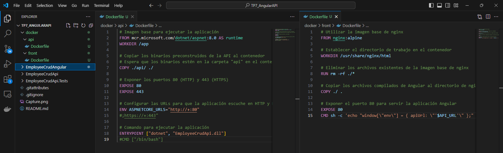


   	- ##### 4.1.2 Crear un recurso ACR en Azure Portal siguiendo el instructivo 5.1
		- 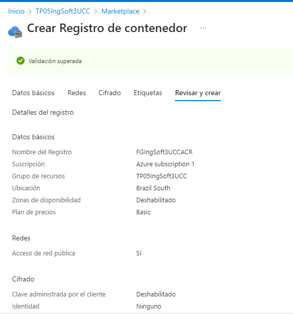
		- 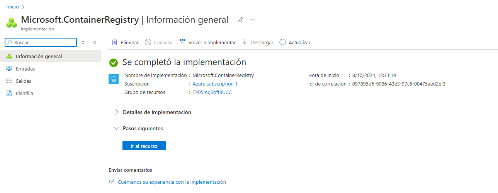
		- 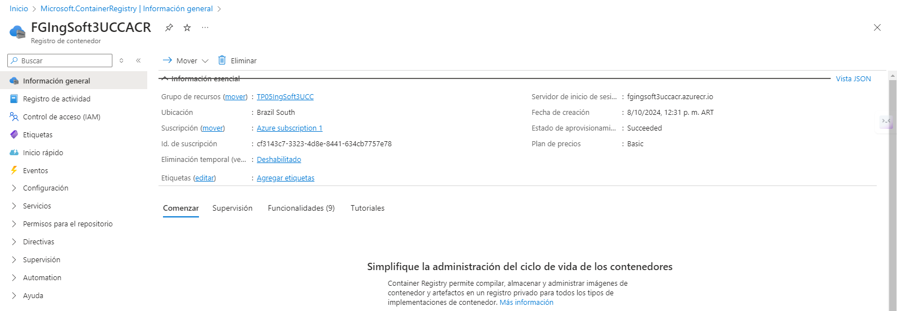

  	- ##### 4.1.3 Modificar nuestro pipeline en la etapa de Build y Test
   	  - Luego de la tarea de publicación de los artefactos de Back agregar la tarea de publicación de nuestro dockerfile de back para que esté disponible en etapas posteriores:
   			- 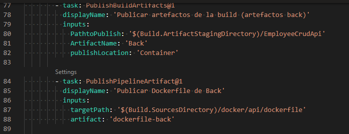
   	  - Luego de la tarea de publicación de los artefactos de Front agregar la tarea de publicación de nuestro dockerfile de front para que esté disponible en etapas posteriores:
   	    	- 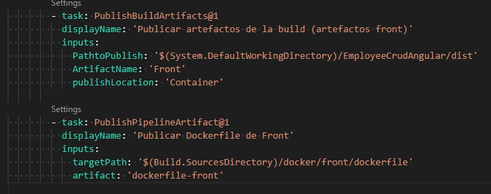

  	- ##### 4.1.4 En caso de no contar en nuestro proyecto con una ServiceConnection a Azure Portal para el manejo de recursos, agregar una service connection a Azure Resource Manager como se indica en instructivo 5.2 
		- 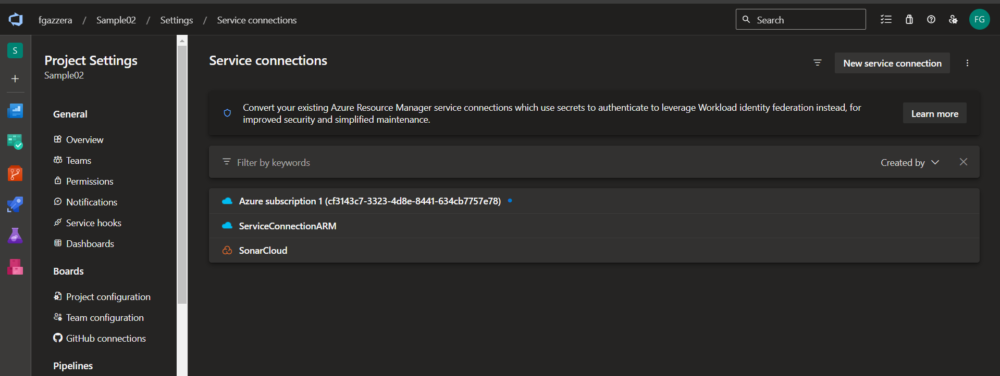

  	- ##### 4.1.5 Agregar a nuestro pipeline variables 
		```yaml
		trigger:
		- main
		
		pool:
		  vmImage: 'windows-latest'
	
		# AZURE VARIABLES
		variables: 
		  ConnectedServiceName: 'NOMBRE_SERVICE_CONNECTION_AZURE_RESOURCE_MANAGER' #Por ejemplo 'ServiceConnectionARM'
		  acrLoginServer: 'URL_DE_RECURSO_ACR' #Por ejemplo 'ascontainerregistry.azurecr.io'
		  backImageName: 'NOMBRE_IMAGEN_QA' #Por ejemplo 'employee-crud-api'
	
		```
  	- ##### 4.1.6 Agregar a nuestro pipeline una nueva etapa que dependa de nuestra etapa de Build y Test
  	  - Agregar tareas para generar imagen Docker de Back
   	  
   	     ```yaml
		# #----------------------------------------------------------
		# ### STAGE BUILD DOCKER IMAGES Y PUSH A AZURE CONTAINER REGISTRY
		# #----------------------------------------------------------
		
		- stage: DockerBuildAndPush
		  displayName: 'Construir y Subir Imágenes Docker a ACR'
		  dependsOn: BuildAndTestBackAndFront #NOMBRE DE NUESTRA ETAPA DE BUILD Y TEST
		  jobs:
		    - job: docker_build_and_push
		      displayName: 'Construir y Subir Imágenes Docker a ACR'
		      pool:
		        vmImage: 'ubuntu-latest'
		
		      steps:
		        - checkout: self
		
		        #----------------------------------------------------------
		        # BUILD DOCKER BACK IMAGE Y PUSH A AZURE CONTAINER REGISTRY
		        #----------------------------------------------------------
		
		        - task: DownloadPipelineArtifact@2
		          displayName: 'Descargar Artefactos de Back'
		          inputs:
		            buildType: 'current'
		            artifactName: 'drop-back'
		            targetPath: '$(Pipeline.Workspace)/drop-back'
		        
		        - task: DownloadPipelineArtifact@2
		          displayName: 'Descargar Dockerfile de Back'
		          inputs:
		            buildType: 'current'
		            artifactName: 'dockerfile-back'
		            targetPath: '$(Pipeline.Workspace)/dockerfile-back'
		
		        - task: AzureCLI@2
		          displayName: 'Iniciar Sesión en Azure Container Registry (ACR)'
		          inputs:
		            azureSubscription: '$(ConnectedServiceName)'
		            scriptType: bash
		            scriptLocation: inlineScript
		            inlineScript: |
		              az acr login --name $(acrLoginServer)
		    
		        - task: Docker@2
		          displayName: 'Construir Imagen Docker para Back'
		          inputs:
		            command: build
		            repository: $(acrLoginServer)/$(backImageName)
		            dockerfile: $(Pipeline.Workspace)/dockerfile-back/dockerfile
		            buildContext: $(Pipeline.Workspace)/drop-back
		            tags: 'latest'
		
		        - task: Docker@2
		          displayName: 'Subir Imagen Docker de Back a ACR'
		          inputs:
		            command: push
		            repository: $(acrLoginServer)/$(backImageName)
		            tags: 'latest'
	  ```yaml
  	
  	- ##### 4.1.7 - Ejecutar el pipeline y en Azure Portal acceder a la opción Repositorios de nuestro recurso Azure Container Registry. Verificar que exista una imagen con el nombre especificado en la variable backImageName asignada en nuestro pipeline
- 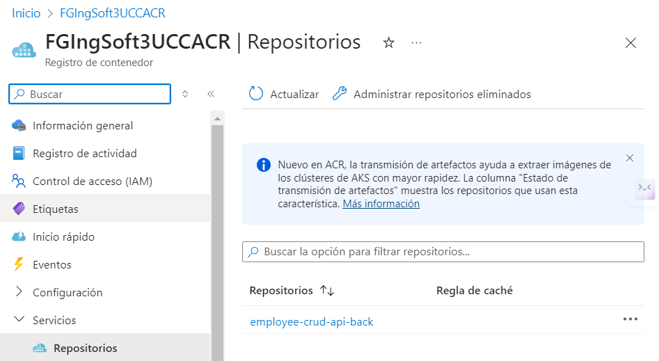
                             
	- ##### 4.1.8 - Agregar tareas para generar imagen Docker de Front (DESAFIO)
  	  - A la etapa creada en 4.1.6 Agregar tareas para generar imagen Docker de Front
	  
	    ```yaml
		    #----------------------------------------------------------
			# BUILD DOCKER FRONT IMAGE Y PUSH A AZURE CONTAINER REGISTRY
			#----------------------------------------------------------

				- task: DownloadPipelineArtifact@2
					displayName: 'Descargar Artefactos de Front'
					inputs:
					buildType: 'current'
					artifactName: 'Front'
					targetPath: '$(Pipeline.Workspace)/Front'

				- task: DownloadPipelineArtifact@2
					displayName: 'Descargar Dockerfile de Front'
					inputs:
					buildType: 'current'
					artifactName: 'dockerfile-front'
					targetPath: '$(Pipeline.Workspace)/dockerfile-front'

				- task: AzureCLI@2
					displayName: 'Iniciar Sesión en Azure Container Registry (ACR)'
					inputs:
					azureSubscription: '$(ConnectedServiceName)'
					scriptType: bash
					scriptLocation: inlineScript
					inlineScript: |
						az acr login --name $(acrLoginServer)

				- task: Docker@2
					displayName: 'Construir Imagen Docker para Front'
					inputs:
					command: build
					repository: $(acrLoginServer)/$(frontImageName)
					dockerfile: $(Pipeline.Workspace)/dockerfile-front/dockerfile
					buildContext: $(Pipeline.Workspace)/Front
					tags: 'latest'
					
				- task: Docker@2
					displayName: 'Subir Imagen Docker de Front a ACR'
					inputs:
					command: push
					repository: $(acrLoginServer)/$(frontImageName)
					tags: 'latest'

	  ```yaml

- 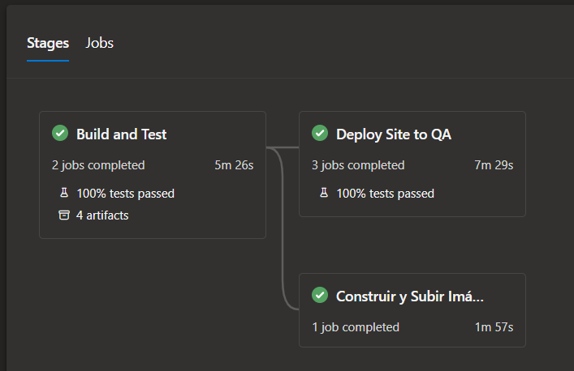
- 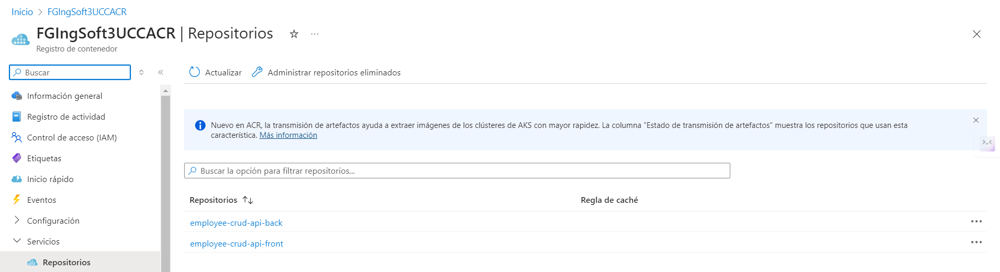
	  
  	- ##### 4.1.9 - Agregar a nuestro pipeline una nueva etapa que dependa de nuestra etapa de Construcción de Imagenes Docker y subida a ACR
	  - Agregar variables a nuestro pipeline:
  	  ```yaml
  	  ResourceGroupName: 'NOMBRE_GRUPO_RECURSOS' #Por ejemplo 'TPS_INGSOFT3_UCC'
	  backContainerInstanceNameQA: 'NOMBRE_CONTAINER_BACK_QA' #Por ejemplo 'as-crud-api-qa'
	  backImageTag: 'latest' 
	  container-cpu-api-qa: 1 #CPUS de nuestro container de QA
	  container-memory-api-qa: 1.5 #RAM de nuestro container de QA
  	  ```
		- 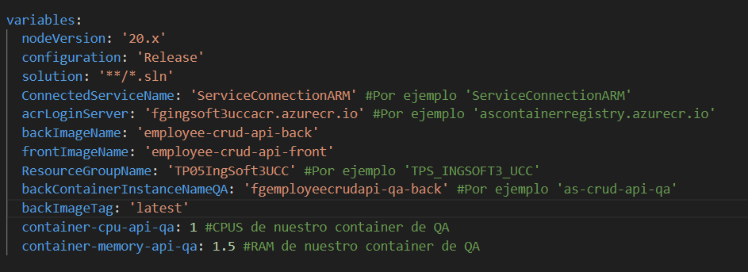

  	  - Agregar variable secreta cnn-string-qa desde la GUI de ADO que apunte a nuestra BD de SQL Server de QA como se indica en el instructivo 5.3
  	    - 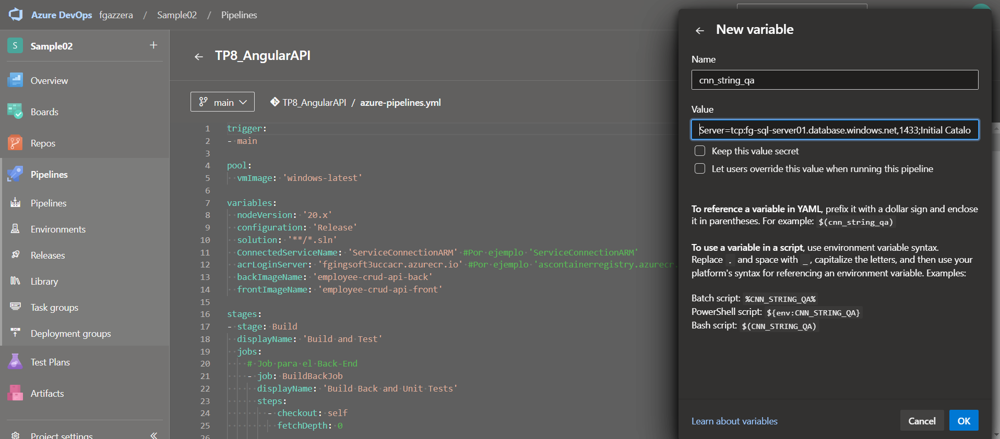
		- 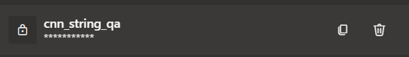


  	  - Agregar tareas para crear un recurso Azure Container Instances que levante un contenedor con nuestra imagen de back
  	  ```yaml
  	  #----------------------------------------------------------
		### STAGE DEPLOY TO ACI QA
		#----------------------------------------------------------
		
		- stage: DeployToACIQA
		  displayName: 'Desplegar en Azure Container Instances (ACI) QA'
		  dependsOn: DockerBuildAndPush
		  jobs:
		    - job: deploy_to_aci_qa
		      displayName: 'Desplegar en Azure Container Instances (ACI) QA'
		      pool:
		        vmImage: 'ubuntu-latest'
		
		      steps:
		        #------------------------------------------------------
		        # DEPLOY DOCKER BACK IMAGE A AZURE CONTAINER INSTANCES QA
		        #------------------------------------------------------
		
		        - task: AzureCLI@2
		          displayName: 'Desplegar Imagen Docker de Back en ACI QA'
		          inputs:
		            azureSubscription: '$(ConnectedServiceName)'
		            scriptType: bash
		            scriptLocation: inlineScript
		            inlineScript: |
		              echo "Resource Group: $(ResourceGroupName)"
		              echo "Container Instance Name: $(backContainerInstanceNameQA)"
		              echo "ACR Login Server: $(acrLoginServer)"
		              echo "Image Name: $(backImageName)"
		              echo "Image Tag: $(backImageTag)"
		              echo "Connection String: $(cnn-string-qa)"
		          
		              az container delete --resource-group $(ResourceGroupName) --name $(backContainerInstanceNameQA) --yes
		
		              az container create --resource-group $(ResourceGroupName) \
		                --name $(backContainerInstanceNameQA) \
		                --image $(acrLoginServer)/$(backImageName):$(backImageTag) \
		                --registry-login-server $(acrLoginServer) \
		                --registry-username $(acrName) \
		                --registry-password $(az acr credential show --name $(acrName) --query "passwords[0].value" -o tsv) \
		                --dns-name-label $(backContainerInstanceNameQA) \
		                --ports 80 \
		                --environment-variables ConnectionStrings__DefaultConnection="$(cnn-string-qa)" \
		                --restart-policy Always \
		                --cpu $(container-cpu-api-qa) \
		                --memory $(container-memory-api-qa)
  	  ```

  	  - ##### 4.1.10 - Ejecutar el pipeline y en Azure Portal acceder al recurso de Azure Container Instances creado. Copiar la url del contenedor y navegarlo desde browser. Verificar que traiga datos.

	  - 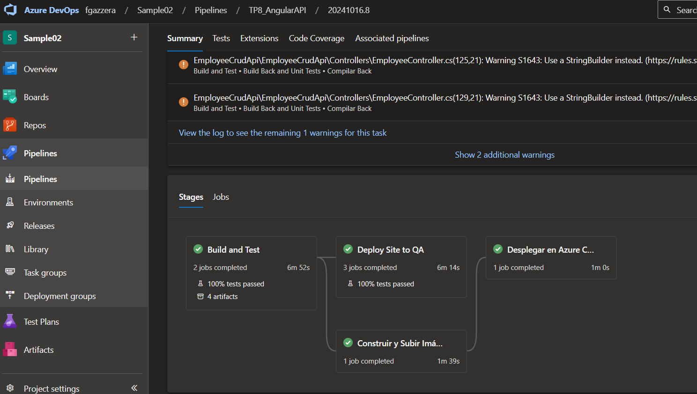
	  - 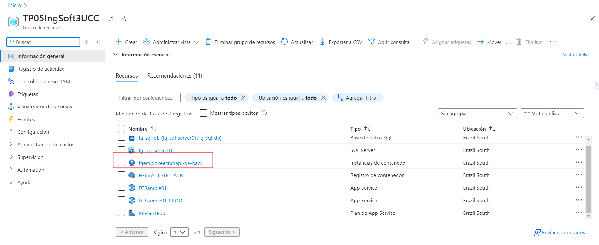
	  - 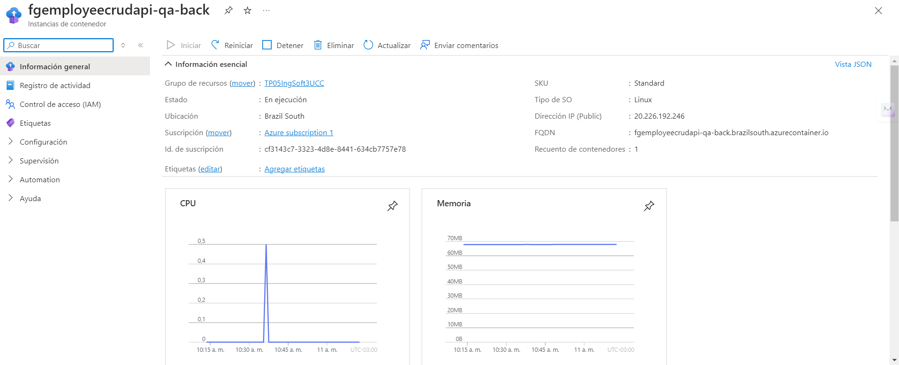
	  - 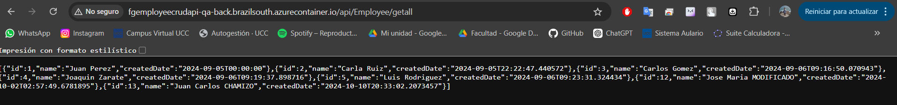
	  - Link: http://fgemployeecrudapi-qa-back.brazilsouth.azurecontainer.io/api/Employee/getall 

  	  - ##### 4.1.11 - Agregar tareas para generar un recurso Azure Container Instances que levante un contenedor con nuestra imagen de front (DESAFIO)
  	  	- A la etapa creada en 4.1.9 Agregar tareas para generar contenedor en ACI con nuestra imagen de Front
  	        - Tener en cuenta que el contenedor debe recibir como variable de entorno API_URL el valor de una variable container-url-api-qa definida en nuestro pipeline.
  	        - Para que el punto anterior funcione el código fuente del front debe ser modificado para que la url de la API pueda ser cambiada luego de haber sido construída la imagen. Se deja un ejemplo de las modificaciones a realizar en el repo https://github.com/ingsoft3ucc/CrudAngularConEnvironment.git

	
		```yaml
	  #------------------------------------------------------
      # DEPLOY DOCKER FRONT IMAGE A AZURE CONTAINER INSTANCES QA
      #------------------------------------------------------

      - task: AzureCLI@2
        displayName: 'Desplegar Imagen Docker de Front en ACI QA'
        inputs:
          azureSubscription: '$(ConnectedServiceName)'
          scriptType: bash
          scriptLocation: inlineScript
          inlineScript: |
            echo "Resource Group: $(ResourceGroupName)"
            echo "Container Instance Name: $(frontContainerInstanceNameQA)"
            echo "ACR Login Server: $(acrLoginServer)"
            echo "Image Name: $(frontImageName)"
            echo "Image Tag: $(frontImageTag)"
            echo "Api Url: $(container-url-api-qa)"

            az container delete --resource-group $(ResourceGroupName) --name $(frontContainerInstanceNameQA) --yes

            az container create --resource-group $(ResourceGroupName) \
              --name $(frontContainerInstanceNameQA) \
              --image $(acrLoginServer)/$(frontImageName):$(frontImageTag) \
              --registry-login-server $(acrLoginServer) \
              --registry-username $(acrName) \
              --registry-password $(az acr credential show --name $(acrName) --query "passwords[0].value" -o tsv) \
              --dns-name-label $(frontContainerInstanceNameQA) \
              --ports 80 \
              --environment-variables API_URL="$(container-url-api-qa)" \
              --restart-policy Always \
              --cpu $(container-cpu-front-qa) \
              --memory $(container-memory-front-qa)
	```

	- 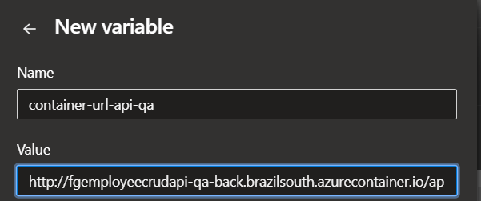
	- 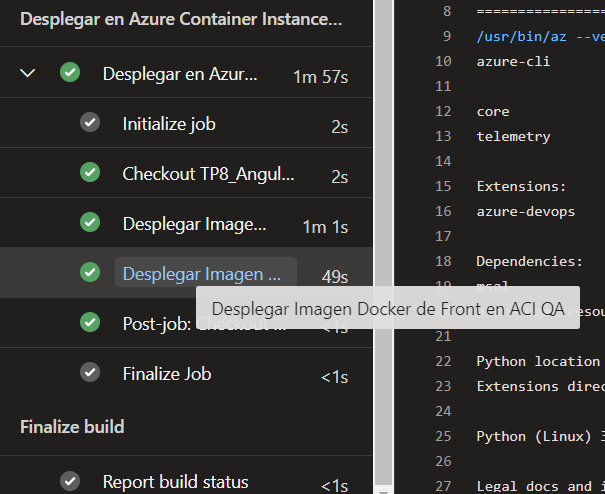
	- 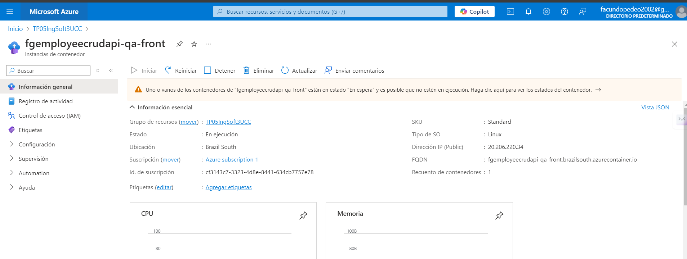
	- 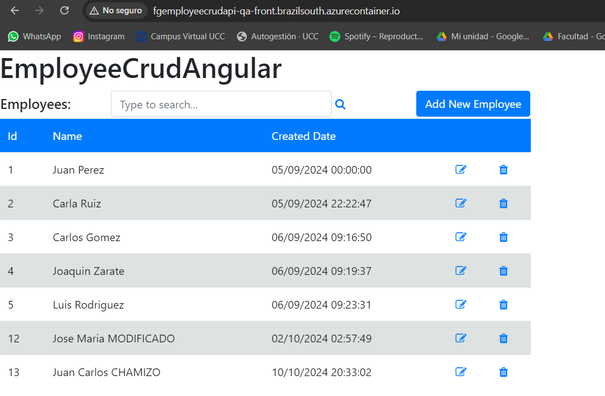


  	- ##### 4.1.12 - Agregar tareas para correr pruebas de integración en el entorno de QA de Back y Front creado en ACI.
  	- 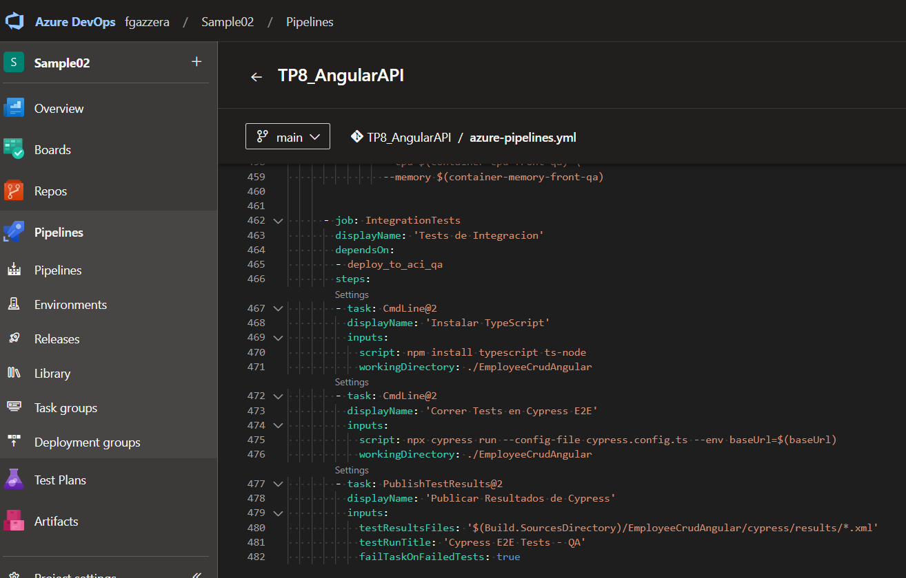 
	- 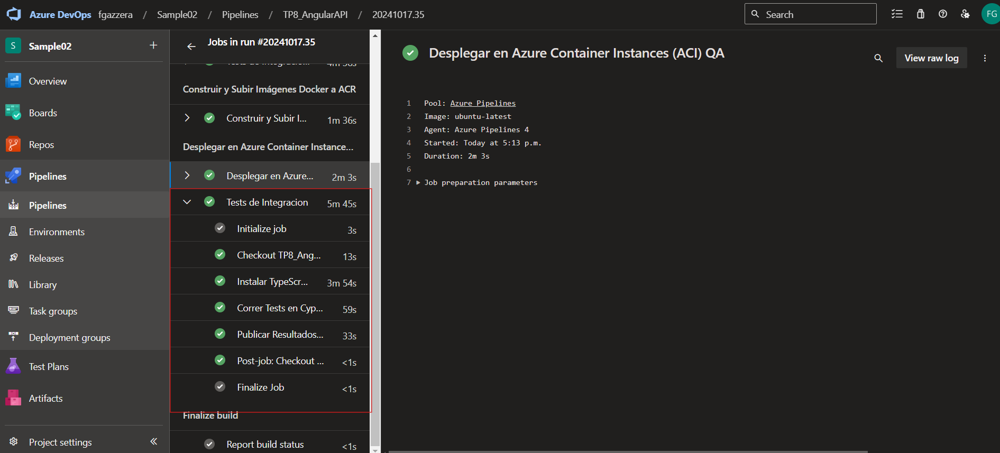


#### 4.4 Desafíos:
- 4.4.1 Agregar tareas para generar imagen Docker de Front. (Punto 4.1.8) (Listo)
- 4.4.2 Agregar tareas para generar en Azure Container Instances un contenedor de imagen Docker de Front. (Punto 4.1.11) (Listo)
- 4.4.3 Agregar tareas para correr pruebas de integración en el entorno de QA de Back y Front creado en ACI. (Punto 4.1.12) (Listo)
- 4.4.4 Agregar etapa que dependa de la etapa de Deploy en ACI QA y genere contenedores en ACI para entorno de PROD. (Listo)

- Debemos crear una nueva variable secreta en el Pipeline para que apunte a la BD de PROD, llamada: "cnn_string_prod"
	- 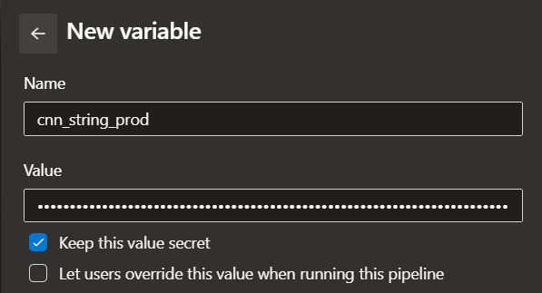

- Otras variables a crear:
	- 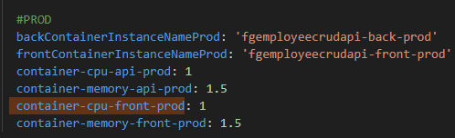

- 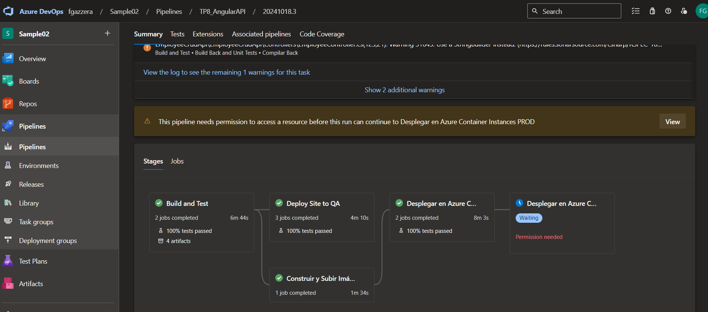 
- 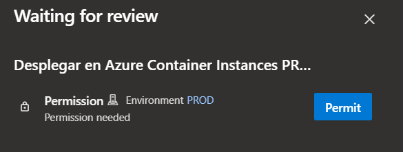
- 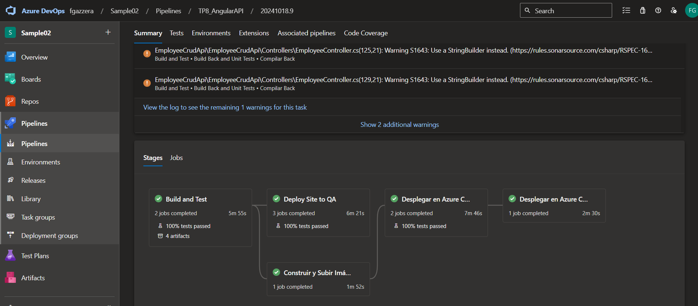

- Ahora tenemos los 2 nuevos contenedores de PROD:
	- 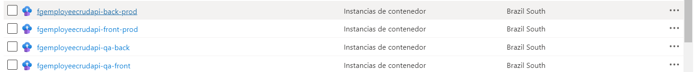
	- 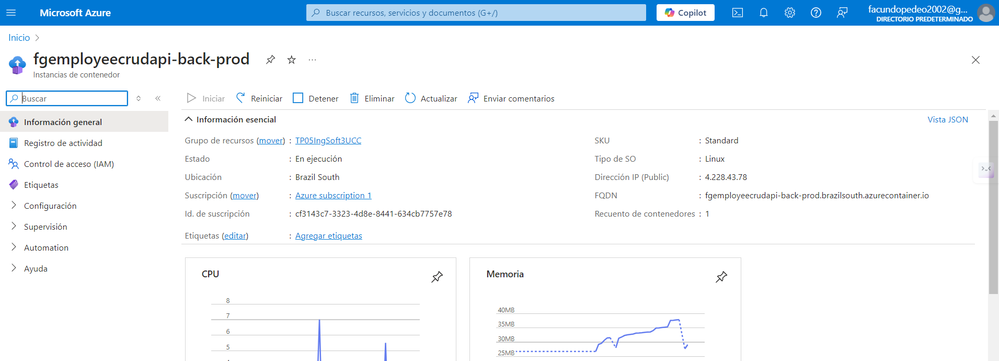
	- 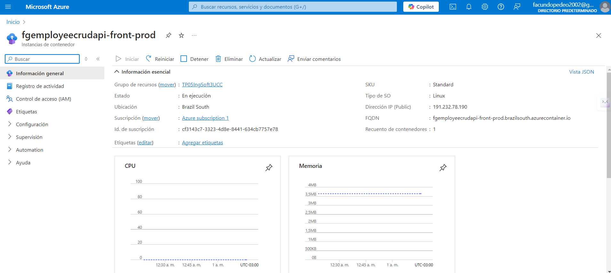

- Vemos que tienen dentro el back y front funcionando:
	- 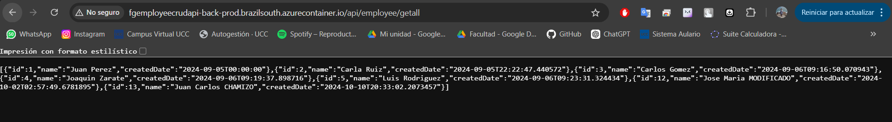
	- 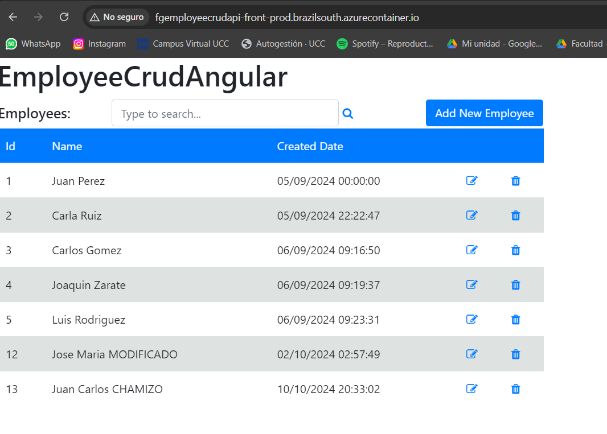

### 5- Instructivos:

### 5.1 Crear un recurso Azure Container Registry

1\. Crear un nuevo recurso en nuestro grupo de recursos


2\. Type "azure container registry [[enter]]"


3\. Click en Crear Container registry


4\. Click the "Nombre del Registro" field.


5\. Ingresar un nombre unico para nuestro ACR, como &lt;iniciales&gt;IngSoft3UCCACR


6\. En el combo Plan de Precios seleccionar "Básico"


7\. Click "Siguiente: Redes >"


8\. Click "Siguiente: Cifrado >"


9\. Click "Siguiente: Etiquetas >"


10\. Click "Siguiente: Revisar y crear >"


11\. Click "Crear"


12\. Click "Ir al recurso"


13\. Copiar la url de nuestro recurso ACR


### 5.2 Crear una Service Connection a Azure Resource Manager en Azure DevOps

1\. En nuestro proyecto de ADO, click "Project settings"


2\. Click "Service connections"


3\. Click "New service connection"


4\. Click "Azure Resource Manager"


5\. Click "Next"


6\. Dejar seleccionado el Authentication method por defecto y Click "Next"


7\. Ingresar nuestro mail de Azure Portal


8\. Click this button.


9\. Ingresar contraseña de cuenta de Azure Portal y Click "Sign in"


10\. Seleccionar la suscripción y expandir el combo "Resource group"


11\. Seleccionar el grupo de recursos donde creamos nuestro recurso de Azure Container Registry


12\. Colocarle un nombre a la Service Connection


13\. Type "ServiceConnectionARM"


14\. Click "Grant access permission to all pipelines"


15\. Click "Save"


### 5.3  Configurar variables secretas en Azure DevOps

1\. En nuestro pipeline Click "Variables"


2\. Click here.


3\. Type "cnn_string_qa"


4\. Click this text field.


5\. Ingresar la cadena de conexión de nuestra BD de SQL Server


6\. Click "Keep this value secret"


7\. Click "OK"


8\. Click "Save"


### 6-  Presentación del trabajo práctico.
- Subir un doc al repo de GitHub con las capturas de pantalla de los pasos realizados. Debe ser un documento (md, word, o pdf), no videos. Y el documento debe seguir los pasos indicados en el Desarrollo del TP.
- Acceso al repo de Azure Devops para revisar el trabajo realizado.

### 7-  Criterio de Calificación
Los pasos 4.1 al 4.X representan un 60% de la nota total, los pasos 4.X y subsiguientes representan el 40% restante.

### Notas:
- Se trabajo sobre el Pipeline del TP7, Repo "TP7_AngularAPI" y use Grupo de Recursos: "TP05IngSoft3UCC"


